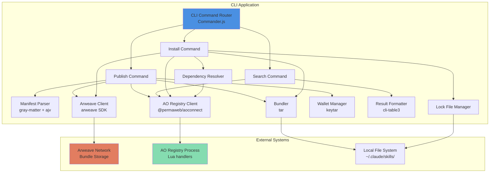
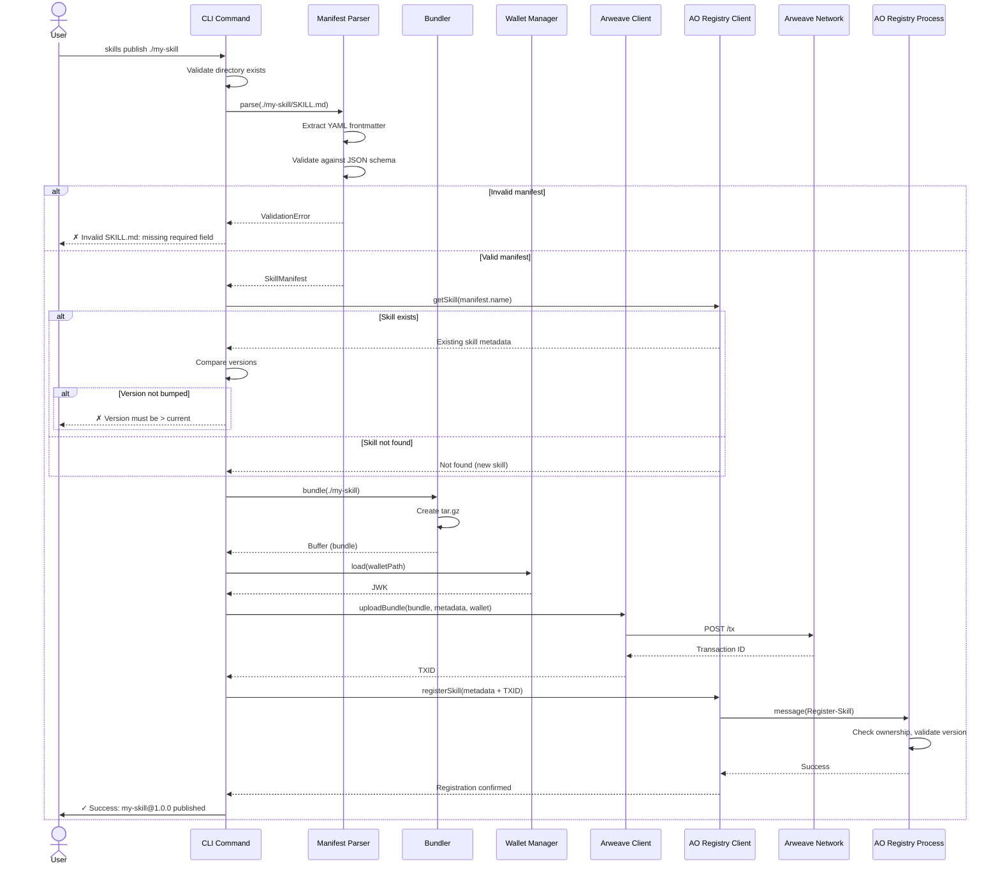
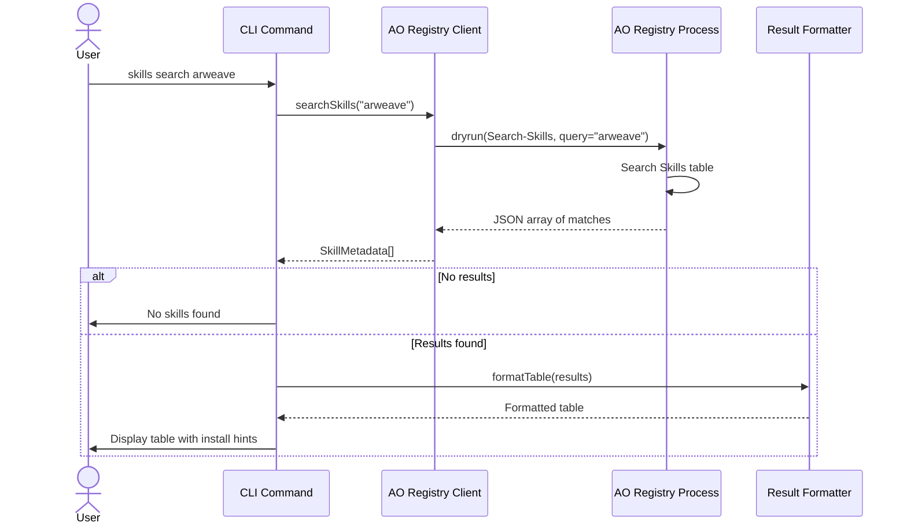
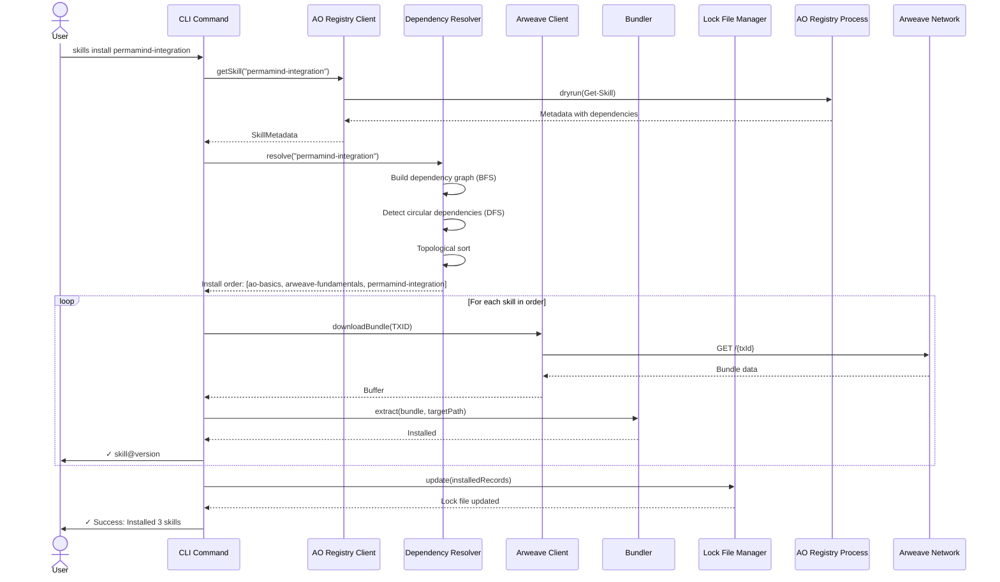

# Agent Skills Registry Architecture Document

## Introduction

This document outlines the overall project architecture for Agent Skills Registry, including backend systems, shared services, and non-UI specific concerns. Its primary goal is to serve as the guiding architectural blueprint for AI-driven development, ensuring consistency and adherence to chosen patterns and technologies.

**Relationship to Frontend Architecture:**
This is a backend-only/CLI project with no traditional frontend interface. The user interface is the command-line terminal (macOS Terminal, Linux shells, Windows PowerShell/CMD).

### Starter Template or Existing Project

**N/A** - This is a greenfield project starting from scratch. The monorepo structure will be manually configured with TypeScript, Node.js tooling, and the specified technology stack (Commander.js, Jest, etc.). No starter templates will be used to maintain full control over project structure and avoid unnecessary dependencies that could slow the 2-week sprint.

### Change Log

| Date | Version | Description | Author |
|------|---------|-------------|--------|
| 2025-10-21 | v1.0 | Initial architecture document creation | Winston (Architect) |

---

## High Level Architecture

### Technical Summary

The Agent Skills Registry employs a **serverless three-layer architecture** leveraging decentralized infrastructure (Arweave + AO) to eliminate traditional hosting costs and maintenance overhead. The system is built as a Node.js CLI tool that orchestrates interactions between local file operations, Arweave's permanent storage layer, and an AO process-based registry index. Core technology choices include TypeScript for type safety, Commander.js for CLI parsing, and a monorepo structure to keep all components (CLI, AO process, bootstrap skills) versioned together. The architecture prioritizes cross-platform compatibility, >95% installation reliability, and familiar npm-like developer experience while achieving complete decentralization through Arweave/AO integration.

### High Level Overview

**Architectural Style:** Serverless Three-Layer Architecture with Decentralized Storage

**Repository Structure:** Monorepo (from PRD Technical Assumptions)
- All components (CLI, AO process Lua code, bootstrap skills, tests, docs) coexist in single repository
- Simplifies version coordination and dependency management for solo developer
- Enables atomic releases where CLI and AO registry schema evolve together

**Service Architecture:** Serverless Decentralized (from PRD Technical Assumptions)
1. **CLI Layer** - Node.js/TypeScript command-line tool running on user's machine
2. **Integration Layer** - SDK-based communication (Arweave SDK, @permaweb/aoconnect)
3. **Storage/Registry Layer** - Arweave (immutable bundle storage) + AO process (mutable skill index)

**Primary User Interaction Flow:**
1. **Publish Flow:** Developer runs `skills publish <dir>` → CLI bundles skill → uploads to Arweave → registers metadata in AO process → returns TXID
2. **Search Flow:** Developer runs `skills search <query>` → CLI queries AO registry → formats/displays results table
3. **Install Flow:** Developer runs `skills install <name>` → CLI queries AO registry for TXID → downloads bundle from Arweave → resolves dependencies → extracts to local directory → updates lock file

**Key Architectural Decisions:**

1. **Decentralized Over Centralized:** Using Arweave + AO eliminates server hosting, reduces costs to near-zero, and aligns with permanent storage value proposition. Trade-off: No traditional database query capabilities, must design around eventual consistency.

2. **Monorepo Over Polyrepo:** Keeps CLI, AO process code, and bootstrap skills in sync. Critical for 2-week sprint where breaking changes could occur frequently. Trade-off: Slightly larger repo size, but tooling complexity minimal for small team.

3. **CLI-First Over Web UI:** Targets developer workflow integration, enables scripting/automation, faster MVP delivery. Web interface deferred to post-MVP per PRD scope.

4. **File-Based Wallet Storage Over Hardware Wallet:** Simplifies MVP implementation while supporting keychain encryption where available. Trade-off: Security depends on file permissions, but acceptable for MVP with clear documentation.

### High Level Project Diagram

```mermaid
graph TB
    User[Developer/User] -->|commands| CLI[CLI Tool<br/>Node.js/TypeScript]

    CLI -->|publish bundle| Arweave[Arweave Network<br/>Permanent Storage]
    CLI -->|query metadata| AORegistry[AO Registry Process<br/>Skill Index]
    CLI -->|download bundle| Arweave
    CLI -->|register skill| AORegistry
    CLI -->|read/write| LocalFS[Local File System<br/>~/.claude/skills/]

    Arweave -->|stores| Bundles[Skill Bundles<br/>tar.gz files]
    AORegistry -->|maintains| Index[Skills Index<br/>name, version, TXID, metadata]

    LocalFS -->|contains| Installed[Installed Skills<br/>SKILL.md + files]
    LocalFS -->|contains| LockFile[skills-lock.json<br/>dependency tree]

    CLI -->|uses| ArweaveSDK[Arweave SDK<br/>upload/download]
    CLI -->|uses| AOConnect[@permaweb/aoconnect<br/>message passing]

    style CLI fill:#4A90E2
    style Arweave fill:#E27D60
    style AORegistry fill:#85DCB0
    style LocalFS fill:#E8A87C
```

### Architectural and Design Patterns

- **Serverless Architecture:** No traditional servers or databases; entire backend runs on decentralized infrastructure (Arweave storage + AO compute). *Rationale:* Eliminates hosting costs, aligns with project's decentralization values, and supports first-mover advantage by avoiding infrastructure setup delays.

- **CLI Command Pattern:** Each command (publish, search, install) encapsulated as separate modules with shared utilities. *Rationale:* Enables independent testing, clear separation of concerns, and easier feature addition post-MVP (e.g., `skills list`, `skills update`).

- **Dependency Injection (SDK Abstraction):** Arweave SDK and @permaweb/aoconnect wrapped in abstraction layers. *Rationale:* Enables mocking for tests (no real uploads during test suite), allows SDK swapping if needed, and isolates external API changes from core CLI logic.

- **Repository Pattern (Lock File):** skills-lock.json acts as local repository of installation state with dependency graph. *Rationale:* Enables reproducible installations, provides audit trail, and supports future features like `skills prune` or version rollback.

- **Message-Based Communication (AO):** AO registry process uses message handlers (Register-Skill, Search-Skills, Get-Skill). *Rationale:* Follows AO protocol standards (ADP v1.0), enables asynchronous processing, and allows registry evolution without CLI changes (handler versioning).

- **Fail-Fast Validation:** Input validation at CLI boundary before expensive operations (bundling, uploading). *Rationale:* Improves UX by catching errors early, reduces wasted Arweave transaction costs, and supports >95% installation reliability target.

---

## Tech Stack

### Cloud Infrastructure

**Provider:** Decentralized Infrastructure (Arweave + AO Networks)

**Key Services:**
- **Arweave Network** - Permanent data storage for skill bundles (tar.gz files)
- **AO Network** - Decentralized compute for registry process (Lua handlers)
- **npm Registry** - CLI tool distribution

**Deployment Regions:** Global (decentralized, no specific regions)

**Cost Model:**
- Arweave: Pay-per-upload (one-time, permanent storage)
- AO: Currently free (no AR tokens required for process spawning or messages)
- npm: Free for open-source packages

### Technology Stack Table

| Category | Technology | Version | Purpose | Rationale |
|----------|-----------|---------|---------|-----------|
| **Language** | TypeScript | 5.3.3 | Primary development language | Strong typing prevents runtime errors, excellent IDE support, team expertise from PRD |
| **Runtime** | Node.js | 20.11.0 LTS | JavaScript runtime | Latest LTS, stable performance, cross-platform support, exceeds PRD requirement (16+) |
| **Package Manager** | npm | 10.x (bundled with Node) | Dependency management | Built-in with Node.js, widely supported, no additional installation |
| **Monorepo** | npm workspaces | (built-in) | Monorepo management | Zero config, sufficient for 4-package structure, avoids Turborepo/Nx overhead |
| **CLI Framework** | Commander.js | ^12.0.0 | Command parsing and routing | Industry standard, robust argument parsing, subcommand support (PRD specified) |
| **YAML Parsing** | gray-matter | ^4.0.3 | SKILL.md frontmatter extraction | De facto standard for frontmatter parsing, simple API (PRD specified) |
| **JSON Schema** | ajv | ^8.12.0 | Manifest validation | Fast, standards-compliant JSON Schema validator (PRD specified) |
| **Archiving** | tar | ^6.2.0 | Bundle creation/extraction | Native Node.js tar support, cross-platform compatibility (PRD specified) |
| **Progress UI** | ora | ^8.0.1 | Spinner/progress indicators | Beautiful CLI spinners, widely used (PRD specified) |
| **Color Output** | chalk | ^5.3.0 | Terminal color formatting | Standard for terminal colors, zero dependencies (PRD specified) |
| **Table Formatting** | cli-table3 | ^0.6.3 | Search results display | Flexible table rendering, terminal width aware (PRD specified) |
| **Encryption** | keytar | ^7.9.0 | System keychain integration | Native keychain access (macOS Keychain, Windows Credential Vault, Linux Secret Service) (PRD specified) |
| **Testing Framework** | Jest | ^29.7.0 | Unit and integration testing | TypeScript support, mocking, snapshot testing (PRD specified) |
| **AO Testing** | aolite | latest | Local AO process emulation | Lua 5.3-based AO emulator, no network needed for tests (PRD specified) |
| **Arweave SDK** | arweave | ^1.14.4 | Transaction creation and upload | Official Arweave JavaScript SDK for bundle uploads |
| **AO Integration** | @permaweb/aoconnect | ^0.0.53 | AO message passing | Official AO SDK for registry queries and registration (PRD specified) |
| **HTTP Client** | (built-in fetch) | Node 20.x native | Arweave gateway requests | Native Node.js fetch (18+), no axios/node-fetch needed |
| **Linter** | ESLint | ^8.56.0 | Code quality and consistency | TypeScript-aware linting, catches common errors |
| **Formatter** | Prettier | ^3.2.4 | Code formatting | Consistent code style, integrates with ESLint |
| **Type Checking** | tsc (TypeScript) | 5.3.3 | Compile-time type safety | Native TypeScript compiler for type checking |
| **Build Tool** | tsc + npm scripts | (native) | TypeScript compilation | Native tooling, no webpack/rollup complexity for CLI |
| **Local State Storage** | JSON files | native | Lock file (skills-lock.json) | Simple, human-readable, no database needed for local state |
| **Registry Database** | AO Process Lua tables | AO mainnet | Mutable skill index (search queries) | Decentralized state management, query-optimized structure |
| **Bundle Storage** | Arweave blockchain | mainnet | Immutable skill bundle storage | Permanent storage, content-addressed retrieval via TXID |
| **Storage** | Arweave Network | mainnet | Immutable bundle storage | Permanent storage, transaction-based addressing |
| **Registry** | AO Process | mainnet | Mutable skill index | Decentralized compute, message-based queries |
| **Distribution** | npm Registry | npmjs.com | CLI package distribution | Standard JavaScript package distribution |
| **Version Control** | Git + GitHub | latest | Source control and collaboration | Industry standard, free public repos |
| **Process Deployment** | @permaweb/aoconnect | ^0.0.53 | AO process spawning and deployment (CI/CD) | Script-based deployment, no MCP dependency for automation |
| **Manual Deployment** | Permamind MCP Server | latest | AO process spawning (local development) | Interactive deployment for testing and development |
| **CI/CD** | GitHub Actions | latest | Automated testing and deployment | Free for public repos, integrated with GitHub |
| **Environment Config** | dotenv | ^16.4.0 | Environment variable management | Load .env files for process IDs, network config |

---

## Data Models

### Skill Metadata Model

**Purpose:** Represents a publishable/installable skill with all metadata required for discovery, installation, and dependency resolution.

**Key Attributes:**
- `name`: `string` - Unique skill identifier (e.g., "ao-basics")
- `version`: `string` - Semantic version (e.g., "1.0.0")
- `description`: `string` - Human-readable skill purpose (max 1024 chars per PRD FR7)
- `author`: `string` - Skill creator identifier (human-readable display name)
- `owner`: `string` - Arweave address (43-char) from `msg.From` who published the skill (immutable after registration)
- `tags`: `string[]` - Searchable category tags (e.g., ["ao", "blockchain", "tutorial"])
- `dependencies`: `string[]` - Array of required skill names (e.g., ["ao-basics", "arweave-fundamentals"])
- `arweaveTxId`: `string` - 43-character Arweave transaction ID pointing to bundle
- `license`: `string` (optional) - License identifier (e.g., "MIT")
- `publishedAt`: `number` - Unix timestamp of original publication
- `updatedAt`: `number` - Unix timestamp of last update (enables tracking version history)

**Relationships:**
- **Self-referential dependency tree:** Skills reference other Skills via `dependencies` array
- **Bundle storage:** `arweaveTxId` links to Skill Bundle stored on Arweave
- **Registry index:** Stored in AO Process registry for search/discovery

**Storage Location:** AO Process Lua tables (registry state)

### Skill Bundle Model

**Purpose:** Physical tar.gz archive containing SKILL.md and all skill files for installation.

**Key Attributes:**
- `bundleData`: `Buffer` - Compressed tar.gz binary data
- `contentType`: `string` - MIME type ("application/x-tar+gzip")
- `arweaveTxId`: `string` - Arweave transaction ID (content address)
- `bundleSize`: `number` - Size in bytes (practical limit ~10MB per PRD)
- `arweaveTags`: `Tag[]` - Arweave transaction tags for metadata
  - `App-Name`: "Agent-Skills-Registry"
  - `Content-Type`: "application/x-tar+gzip"
  - `Skill-Name`: skill name
  - `Skill-Version`: skill version

**Relationships:**
- **Contains:** SKILL.md manifest file + all dependency files (recursive directory structure)
- **Referenced by:** Skill Metadata via `arweaveTxId`
- **Stored on:** Arweave blockchain (immutable)

**Storage Location:** Arweave network (permanent, content-addressed)

### Installed Skill Record Model

**Purpose:** Tracks locally installed skills and their dependency relationships for reproducible installations.

**Key Attributes:**
- `name`: `string` - Installed skill name
- `version`: `string` - Installed version
- `arweaveTxId`: `string` - Source bundle transaction ID
- `installedAt`: `number` - Unix timestamp of installation
- `installedPath`: `string` - Local file system path (e.g., "~/.claude/skills/ao-basics/")
- `dependencies`: `InstalledSkillRecord[]` - Recursive dependency tree
- `isDirectDependency`: `boolean` - True if user-requested, false if transitive dependency

**Relationships:**
- **Parent-child dependency graph:** Each record contains array of dependency records
- **References:** Original Skill Metadata via `arweaveTxId`
- **Stored in:** skills-lock.json file

**Storage Location:** Local file system (skills-lock.json)

### Lock File Structure Model

**Purpose:** Root document managing all installed skills with dependency graph and metadata.

**Key Attributes:**
- `lockfileVersion`: `number` - Schema version (starts at 1)
- `generatedAt`: `number` - Unix timestamp of last update
- `skills`: `InstalledSkillRecord[]` - Array of all installed skills
- `installLocation`: `string` - Installation directory path

**Relationships:**
- **Contains:** Array of Installed Skill Records with nested dependency trees
- **Owned by:** Local user/project

**Storage Location:** Local file system (~/.claude/skills-lock.json or .claude/skills-lock.json)

### AO Registry Message Models

**Purpose:** Define message schemas for AO process interactions (ADP v1.0 compliance).

**Register-Skill Message:**
- `Action`: "Register-Skill"
- `Name`: skill name
- `Version`: version string
- `Description`: skill description
- `Author`: author identifier (display name)
- `Tags`: JSON array of tags
- `ArweaveTxId`: bundle TXID
- `Dependencies`: JSON array of dependency names

**Search-Skills Message:**
- `Action`: "Search-Skills"
- `Query`: search query string (matches name/description/tags)

**Get-Skill Message:**
- `Action`: "Get-Skill"
- `Name`: skill name

**Info Message (ADP Compliance):**
- `Action`: "Info"
- Returns: Process metadata, handlers list, ADP version

**Relationships:**
- **Request-Response:** CLI sends messages, AO process responds with matching data
- **State mutation:** Register-Skill modifies AO process Lua table state

**Storage Location:** AO process message queue (ephemeral), results persist in AO state

---

## Components

### CLI Command Router

**Responsibility:** Entry point for all user commands; parses arguments, routes to appropriate command handlers, and orchestrates error handling.

**Key Interfaces:**
- `CommandInterface` - Abstract interface all commands implement (execute, validate, help)
- CLI entry point: `skills <command> [args] [flags]`
- Global flags: `--verbose`, `--no-banner`, `--wallet <path>`

**Dependencies:**
- Commander.js for argument parsing
- All command modules (PublishCommand, SearchCommand, InstallCommand)
- Configuration loader for `.skillsrc` settings

**Technology Stack:**
- TypeScript
- Commander.js (^12.0.0)
- Chalk for colored output

**Component Files:**
```
cli/src/index.ts           # Entry point, commander setup
cli/src/commands/base.ts   # BaseCommand abstract class
```

### Publish Command Module

**Responsibility:** Handles `skills publish <directory>` workflow - validates manifest, bundles files, uploads to Arweave, registers in AO process.

**Key Interfaces:**
- `execute(directory: string, options: PublishOptions): Promise<PublishResult>`
- `PublishOptions`: { wallet?: string, verbose?: boolean }
- `PublishResult`: { txId: string, skillName: string, version: string }

**Dependencies:**
- Manifest Parser (validates SKILL.md)
- Bundler (creates tar.gz)
- Arweave Client (uploads bundle)
- AO Registry Client (registers metadata)
- Wallet Manager (loads keypair)

**Technology Stack:**
- TypeScript
- ora (progress spinners)
- chalk (success/error colors)

**Component Files:**
```
cli/src/commands/publish.ts
```

### Search Command Module

**Responsibility:** Handles `skills search <query>` workflow - queries AO registry, formats results as table.

**Key Interfaces:**
- `execute(query: string, options: SearchOptions): Promise<SearchResult[]>`
- `SearchOptions`: { tag?: string[], json?: boolean, verbose?: boolean }
- `SearchResult`: { name, author, version, description, tags }

**Dependencies:**
- AO Registry Client (Search-Skills query)
- Result Formatter (cli-table3 rendering)

**Technology Stack:**
- TypeScript
- cli-table3 (table rendering)
- chalk (colored output)

**Component Files:**
```
cli/src/commands/search.ts
cli/src/formatters/search-results.ts
```

### Install Command Module

**Responsibility:** Handles `skills install <name>` workflow - queries registry, downloads bundle, resolves dependencies, extracts files, updates lock file.

**Key Interfaces:**
- `execute(skillName: string, options: InstallOptions): Promise<InstallResult>`
- `InstallOptions`: { global?: boolean, local?: boolean, force?: boolean, verbose?: boolean }
- `InstallResult`: { installedSkills: string[], dependencyCount: number }

**Dependencies:**
- AO Registry Client (Get-Skill query)
- Arweave Client (bundle download)
- Dependency Resolver (recursive resolution)
- Bundle Extractor (tar.gz extraction)
- Lock File Manager (update skills-lock.json)

**Technology Stack:**
- TypeScript
- ora (progress indicators)
- tar (extraction)

**Component Files:**
```
cli/src/commands/install.ts
cli/src/lib/dependency-resolver.ts
```

### Manifest Parser

**Responsibility:** Extracts and validates YAML frontmatter from SKILL.md files against JSON schema.

**Key Interfaces:**
- `parse(skillMdPath: string): Promise<SkillManifest>`
- `validate(manifest: SkillManifest): ValidationResult`
- `SkillManifest` type matching data model

**Dependencies:**
- gray-matter (YAML parsing)
- ajv (JSON schema validation)
- File system (read SKILL.md)

**Technology Stack:**
- TypeScript
- gray-matter (^4.0.3)
- ajv (^8.12.0)

**Component Files:**
```
cli/src/parsers/manifest-parser.ts
cli/src/schemas/skill-manifest.schema.json
```

### Bundler

**Responsibility:** Creates tar.gz archives from skill directories, excluding unwanted files.

**Key Interfaces:**
- `bundle(directory: string): Promise<Buffer>`
- `extract(tarBuffer: Buffer, targetPath: string): Promise<void>`
- Exclusion patterns: `.git`, `node_modules`, hidden files

**Dependencies:**
- Node.js tar library
- File system traversal

**Technology Stack:**
- TypeScript
- tar (^6.2.0)

**Component Files:**
```
cli/src/lib/bundler.ts
```

### Arweave Client

**Responsibility:** Uploads bundles to Arweave, downloads bundles by TXID, checks wallet balance.

**Key Interfaces:**
- `uploadBundle(bundle: Buffer, metadata: BundleMetadata, wallet: JWK): Promise<string>`
- `downloadBundle(txId: string): Promise<Buffer>`
- `checkBalance(address: string): Promise<number>`

**Dependencies:**
- Arweave SDK (transaction creation)
- HTTP client (native fetch)

**Technology Stack:**
- TypeScript
- arweave (^1.14.4)
- Node.js native fetch

**Component Files:**
```
cli/src/clients/arweave-client.ts
```

### AO Registry Client

**Responsibility:** Sends messages to AO registry process, handles responses.

**Key Interfaces:**
- `registerSkill(metadata: SkillMetadata): Promise<void>`
- `searchSkills(query: string): Promise<SkillMetadata[]>`
- `getSkill(name: string): Promise<SkillMetadata>`
- `getRegistryInfo(): Promise<RegistryInfo>`

**Dependencies:**
- @permaweb/aoconnect (message passing)
- Configuration (registry process ID)

**Technology Stack:**
- TypeScript
- @permaweb/aoconnect (^0.0.53)

**Component Files:**
```
cli/src/clients/ao-registry-client.ts
```

### Dependency Resolver

**Responsibility:** Recursively resolves skill dependencies, detects circular dependencies, determines installation order via topological sorting.

**Key Interfaces:**
- `resolve(skillName: string): Promise<DependencyTree>`
- `detectCircular(tree: DependencyTree): CircularDependency[]`
- `topologicalSort(tree: DependencyTree): string[]`

**Dependencies:**
- AO Registry Client (fetch dependency metadata)

**Technology Stack:**
- TypeScript
- Graph traversal algorithms (DFS for circular detection, Kahn's algorithm for topological sort)

**Algorithm Specifications:**

#### Circular Dependency Detection (DFS with Three-Color Marking)

```typescript
/**
 * Detects circular dependencies using DFS with color-based cycle detection
 *
 * Algorithm: Three-color marking
 * - WHITE (0): Unvisited node
 * - GRAY (1):  Currently visiting (in recursion stack)
 * - BLACK (2): Fully processed (all descendants visited)
 *
 * Circular dependency exists if we encounter a GRAY node during traversal
 * (indicates back edge to ancestor in current path)
 */

enum NodeColor {
  WHITE = 0,  // Unvisited
  GRAY = 1,   // In current path (recursion stack)
  BLACK = 2   // Fully processed
}
```

**Test Cases:**
- Simple cycle: A→B→A
- Three-node cycle: A→B→C→A
- Self-loop: A→A
- Diamond (no cycle): A→B, A→C, B→D, C→D
- Complex cycle: A→B→D→A, A→C→D

#### Topological Sort (Kahn's Algorithm)

```typescript
/**
 * Determines correct installation order using Kahn's algorithm
 *
 * Algorithm: Process nodes with zero in-degree first
 * 1. Calculate in-degree (number of incoming edges) for each node
 * 2. Start with nodes that have zero in-degree (no dependencies)
 * 3. Remove each zero-degree node and decrease in-degree of neighbors
 * 4. Repeat until all nodes processed
 *
 * Result: Dependencies installed before dependents
 */
```

**Test Cases:**
- Linear chain: A→B→C→D
- Diamond: A→B, A→C, B→D, C→D
- Multiple roots: A→C, B→C, C→D
- Independent nodes: A, B, C (no dependencies)

**Performance Characteristics:**

| Operation | Time Complexity | Space Complexity |
|-----------|-----------------|------------------|
| Circular Detection (DFS) | O(V + E) | O(V) |
| Topological Sort (Kahn) | O(V + E) | O(V) |
| Full Resolution | O(V + E + N) | O(V) |

Where V = skills, E = dependency edges, N = network requests (cached)

**Component Files:**
```
cli/src/lib/dependency-resolver.ts
cli/src/lib/circular-detector.ts
cli/src/lib/topological-sorter.ts
```

### Lock File Manager

**Responsibility:** Reads and updates skills-lock.json with installation records.

**Key Interfaces:**
- `read(path: string): Promise<LockFile>`
- `update(skill: InstalledSkillRecord, path: string): Promise<void>`
- `merge(existingLock: LockFile, newSkills: InstalledSkillRecord[]): LockFile`

**Dependencies:**
- File system (JSON read/write)

**Technology Stack:**
- TypeScript
- Native JSON parsing

**Component Files:**
```
cli/src/lib/lock-file-manager.ts
```

### Wallet Manager

**Responsibility:** Loads Arweave keypairs from file system or system keychain, validates JWK format.

**Key Interfaces:**
- `load(walletPath: string): Promise<JWK>`
- `saveToKeychain(wallet: JWK, identifier: string): Promise<void>`
- `loadFromKeychain(identifier: string): Promise<JWK>`

**Dependencies:**
- keytar (system keychain)
- File system (JWK file reading)

**Technology Stack:**
- TypeScript
- keytar (^7.9.0) with file-based fallback

**Component Files:**
```
cli/src/lib/wallet-manager.ts
```

### AO Registry Process (Lua)

**Responsibility:** AO process maintaining skill registry state with author-based ownership control for updates and deletions.

**Key Interfaces:**
- Handler: `Register-Skill` - Adds skill to registry (stores `msg.From` as owner, enforces version bump for updates)
- Handler: `Search-Skills` - Queries registry by name/description/tags (public read)
- Handler: `Get-Skill` - Retrieves specific skill metadata (public read)
- Handler: `Info` - Returns registry metadata (ADP v1.0)

**Ownership Model:**
- `owner` field set to `msg.From` on initial registration (immutable)
- Updates require `msg.From == owner` and version bump
- Deletes require `msg.From == owner`

**Version Enforcement:**
- Updates must have `version > current version` (semantic version comparison)
- Prevents accidental overwrites
- Maintains version history integrity

**Dependencies:**
- AO runtime (ao.send, Handlers, json, **msg.From** for authorization)
- No external requires (monolithic design per AO best practices)

**Technology Stack:**
- Lua 5.3
- AO process runtime
- JSON encoding/decoding

**Component Files:**
```
ao-process/registry.lua
ao-process/tests/ownership-tests.lua
ao-process/tests/version-enforcement.test.lua
```

### Component Diagrams



---

## External APIs

### Arweave Network API

**Purpose:** Permanent storage for skill bundles; upload tar.gz files and retrieve by transaction ID.

**Documentation:**
- https://docs.arweave.org/developers/
- https://github.com/ArweaveTeam/arweave-js

**Base URL(s):**
- Arweave Gateway (configurable): `https://arweave.net` (default)
- Alternative gateways: `https://g8way.io`, `https://ar-io.dev`

**Authentication:**
- JWK (JSON Web Key) wallet signature for transactions
- No API keys required (cryptographic signatures)

**Rate Limits:**
- Gateway dependent (typically unlimited for reads)
- Transaction submission: Network mempool limits (rarely hit)
- Upload size: Practical limit ~10MB per PRD (cost-based constraint)

**Key Endpoints Used:**

#### Upload Transaction (Bundle Storage)
```
POST /tx
Content-Type: application/json

Body: Signed Arweave transaction with bundle data
```

**Transaction Tags:**
- `App-Name`: "Agent-Skills-Registry"
- `Content-Type`: "application/x-tar+gzip"
- `Skill-Name`: skill name
- `Skill-Version`: skill version

#### Download Bundle by TXID
```
GET /{transactionId}
```

Returns binary tar.gz data

#### Check Wallet Balance
```
GET /wallet/{address}/balance
```

Returns balance in winston (1 AR = 1,000,000,000,000 winston)

#### Transaction Status
```
GET /tx/{transactionId}/status
```

Poll for confirmation (2-5 minute finality)

**Integration Notes:**
- Transaction finality: 2-5 minute wait (CLI communicates with progress indicators)
- Gateway failover: Configurable via `.skillsrc`
- Retry strategy: 3 attempts with exponential backoff
- Timeout: 30s default for downloads, 60s for uploads

### AO Network API (via @permaweb/aoconnect)

**Purpose:** Message-based communication with AO Registry Process for skill registration, search, and retrieval.

**Documentation:**
- https://ao.arweave.dev
- https://github.com/permaweb/ao/tree/main/connect

**Base URL(s):**
- AO Message Unit (MU): Network-dependent
- AO Compute Unit (CU): Network-dependent

**Authentication:**
- Message signatures (JWK wallet)
- No separate auth tokens

**Rate Limits:**
- Network dependent
- Query timeout: 30s (configurable)

**Key Operations:**

#### Send Message to AO Process
```typescript
import { message, result } from '@permaweb/aoconnect';

const messageId = await message({
  process: REGISTRY_PROCESS_ID,
  tags: [
    { name: 'Action', value: 'Register-Skill' },
    { name: 'Name', value: 'ao-basics' },
    { name: 'Version', value: '1.0.0' }
  ],
  signer: createDataItemSigner(wallet)
});
```

#### Query AO Process (Dry Run)
```typescript
import { dryrun } from '@permaweb/aoconnect';

const { Messages } = await dryrun({
  process: REGISTRY_PROCESS_ID,
  tags: [
    { name: 'Action', value: 'Search-Skills' },
    { name: 'Query', value: 'arweave' }
  ]
});
```

**Integration Notes:**
- Registry Process ID stored in configuration
- Use `message()` for state changes (register)
- Use `dryrun()` for queries (search, get)
- Timeout: 30s with retry (2 attempts, 5s delay)

---

## Core Workflows

### Workflow 1: Publish Skill (New Registration)



### Workflow 2: Search Skills



### Workflow 3: Install Skill with Dependencies



---

## Database Schema

### 1. AO Registry Process State (Lua Tables)

**Storage Type:** In-memory Lua tables persisted by AO process runtime

**Schema Definition:**

```lua
-- Global registry state
Skills = {}

-- Example entry
Skills["ao-basics"] = {
  name = "ao-basics",
  version = "1.0.0",
  description = "AO protocol fundamentals",
  author = "John Doe",
  owner = "abc123...xyz789",  -- Arweave address from msg.From
  tags = {"ao", "blockchain", "tutorial"},
  arweaveTxId = "def456...uvw012",
  dependencies = {"arweave-fundamentals"},
  publishedAt = 1234567890,
  updatedAt = 1234567890
}
```

**Constraints:**
- Primary key: `name` (unique)
- Ownership: `owner` field immutable after registration
- Version enforcement: Updates require `version > current version`

**Access Patterns:**
- Register/Update: `Skills[msg.Name] = { ... }` (O(1))
- Get: `return Skills[msg.Name]` (O(1))
- Search: Iterate all entries, filter by query (O(n))

### 2. Arweave Permanent Storage

**Transaction Tags:**
```json
{
  "tags": [
    { "name": "App-Name", "value": "Agent-Skills-Registry" },
    { "name": "Content-Type", "value": "application/x-tar+gzip" },
    { "name": "Skill-Name", "value": "ao-basics" },
    { "name": "Skill-Version", "value": "1.0.0" }
  ],
  "data": "<binary tar.gz bundle>"
}
```

**Bundle Contents:**
```
skill-name.tar.gz
├── SKILL.md
├── resources/
│   ├── examples/
│   └── templates/
└── README.md
```

### 3. Local Lock File (JSON)

**File Location:** `~/.claude/skills-lock.json` or `./.claude/skills-lock.json`

**Schema:**
```json
{
  "lockfileVersion": 1,
  "generatedAt": 1234567890,
  "installLocation": "/Users/john/.claude/skills",
  "skills": [
    {
      "name": "permamind-integration",
      "version": "1.0.0",
      "arweaveTxId": "abc123...def789",
      "installedAt": 1234567890,
      "installedPath": "/Users/john/.claude/skills/permamind-integration",
      "isDirectDependency": true,
      "dependencies": [
        {
          "name": "ao-basics",
          "version": "1.0.0",
          "arweaveTxId": "xyz456...uvw012",
          "installedAt": 1234567889,
          "installedPath": "/Users/john/.claude/skills/ao-basics",
          "isDirectDependency": false,
          "dependencies": []
        }
      ]
    }
  ]
}
```

---

## Source Tree

```
agent-skills-registry/
├── .github/
│   └── workflows/
│       ├── deploy-ao-process.yml
│       ├── publish-cli.yml
│       └── test.yml
│
├── cli/
│   ├── src/
│   │   ├── index.ts
│   │   ├── commands/
│   │   │   ├── base.ts
│   │   │   ├── publish.ts
│   │   │   ├── search.ts
│   │   │   └── install.ts
│   │   ├── clients/
│   │   │   ├── arweave-client.ts
│   │   │   └── ao-registry-client.ts
│   │   ├── lib/
│   │   │   ├── bundler.ts
│   │   │   ├── dependency-resolver.ts
│   │   │   ├── circular-detector.ts
│   │   │   ├── topological-sorter.ts
│   │   │   ├── lock-file-manager.ts
│   │   │   ├── wallet-manager.ts
│   │   │   ├── config-loader.ts
│   │   │   ├── logger.ts
│   │   │   └── retry.ts
│   │   ├── parsers/
│   │   │   └── manifest-parser.ts
│   │   ├── formatters/
│   │   │   └── search-results.ts
│   │   ├── schemas/
│   │   │   ├── skill-manifest.schema.json
│   │   │   └── skills-lock.schema.json
│   │   ├── types/
│   │   │   ├── skill.ts
│   │   │   ├── lock-file.ts
│   │   │   ├── commands.ts
│   │   │   └── errors.ts
│   │   └── utils/
│   │       ├── version-compare.ts
│   │       └── retry.ts
│   ├── tests/
│   │   ├── unit/
│   │   ├── integration/
│   │   ├── fixtures/
│   │   └── helpers/
│   ├── package.json
│   ├── tsconfig.json
│   └── README.md
│
├── ao-process/
│   ├── registry.lua
│   ├── tests/
│   ├── deploy.md
│   └── README.md
│
├── skills/
│   ├── ao-basics/
│   ├── arweave-fundamentals/
│   ├── permamind-integration/
│   ├── agent-skills-best-practices/
│   └── cli-development/
│
├── docs/
│   ├── prd.md
│   ├── architecture.md
│   ├── api-reference.md
│   └── troubleshooting.md
│
├── scripts/
│   ├── bootstrap-publish.ts
│   ├── deploy-ao-process.ts
│   ├── deploy-registry-process.md
│   ├── validate-skills.ts
│   └── generate-schemas.ts
│
├── .env.example
├── .skillsrc.example
├── .gitignore
├── .prettierrc
├── .eslintrc.json
├── package.json
├── tsconfig.json
├── jest.config.js
├── LICENSE
└── README.md
```

---

## Infrastructure and Deployment

### Infrastructure as Code

- **Tool:** Custom deployment script using @permaweb/aoconnect (for CI/CD)
- **Location:** `scripts/deploy-ao-process.ts`
- **Approach:** Automated deployment via GitHub Actions, script spawns process and deploys Lua code

### Deployment Strategy

**AO Registry Process Deployment:**

Uses aoconnect for automated CI/CD deployment:

```typescript
// scripts/deploy-ao-process.ts
import { spawn, message, result, dryrun } from '@permaweb/aoconnect';
import { createDataItemSigner } from '@permaweb/aoconnect';

async function deployAOProcess() {
  const jwk = JSON.parse(process.env.ARWEAVE_WALLET_JWK);
  const signer = createDataItemSigner(jwk);

  // Step 1: Spawn process
  const processId = await spawn({
    module: 'SBNb1qPQ1TDwpD_mboxm2YllmMLXpWw4U8P9Ff8W9vk',
    scheduler: '_GQ33BkPtZrqxA84vM8Zk-N2aO0toNNu_C-l-rawrBA',
    signer,
    tags: [
      { name: 'App-Name', value: 'Agent-Skills-Registry' },
      { name: 'Name', value: 'Skills Registry Process' }
    ]
  });

  // Step 2: Deploy Lua code
  const luaCode = await fs.readFile('ao-process/registry.lua', 'utf-8');
  const evalMessageId = await message({
    process: processId,
    signer,
    tags: [{ name: 'Action', value: 'Eval' }],
    data: luaCode
  });

  // Step 3: Validate deployment
  const { Messages } = await dryrun({
    process: processId,
    tags: [{ name: 'Action', value: 'Info' }]
  });

  // Step 4: Save process ID
  await fs.writeFile('.env', `REGISTRY_PROCESS_ID=${processId}\n`);
}
```

**CLI Distribution:**
- npm package publication
- GitHub Actions triggers on version tags
- Automated publish to npm registry

### Environments

- **Development:** Local (aolite emulation + mocked Arweave)
- **Testnet (Optional):** AO testnet + Arweave testnet
- **Production:** AO mainnet + Arweave mainnet

### Environment Promotion Flow

```
Development (aolite local)
    ↓ (tests pass)
GitHub Actions (Production)
    ↓ (deploy AO process, publish CLI)
Community Launch
```

### Rollback Strategy

**AO Process:**
- Deploy new process with fixed code
- Update CLI configuration with new process ID
- Recovery Time: <30 minutes (automated)

**CLI:**
- npm deprecate broken version
- Publish patch version
- Recovery Time: <1 hour

---

## Error Handling Strategy

### General Approach

- **Error Model:** Typed error classes extending base Error with contextual metadata
- **Exception Hierarchy:**
  ```
  Error (JavaScript native)
  └── SkillsRegistryError (base)
      ├── ValidationError
      ├── NetworkError
      ├── AuthorizationError
      ├── FileSystemError
      ├── DependencyError
      └── ConfigurationError
  ```
- **Error Propagation:** Errors bubble to command level, caught by central handler, translated to user-friendly messages

### Logging Standards

- **Library:** Custom logger utility (`cli/src/lib/logger.ts`)
- **Format:** Structured JSON for verbose mode, human-readable for normal
- **Levels:** ERROR, WARN, INFO, DEBUG
- **Required Context:**
  - Correlation ID: UUID per command invocation
  - Service Context: `{ service: 'cli', command: 'publish', version: '1.0.0' }`
  - User Context: `{ installLocation, os }` (no PII)

### Error Handling Patterns

**External API Errors:**
- **Retry Policy:** 3 attempts for Arweave (exponential backoff), 2 attempts for AO (fixed delay)
- **Timeout:** 60s upload, 30s download, 30s AO queries
- **Error Translation:** Network errors mapped to user-friendly messages with recovery steps

**Business Logic Errors:**
- **Custom Exceptions:** ValidationError, DependencyError, AuthorizationError
- **User-Facing Format:** Error message + "→ Solution: ..." pattern
- **Error Codes:** Exit codes (0=success, 1=user error, 2=system error, 3=authorization)

**Data Consistency:**
- **Transaction Strategy:** Atomic file writes (temp file + rename)
- **Compensation Logic:** Rollback partial installs on failure
- **Idempotency:** Check existing installations, skip if same version

---

## Coding Standards

### Core Standards

- **Languages & Runtimes:**
  - TypeScript 5.3.3 (strict mode) for CLI
  - Lua 5.3 for AO process
  - Node.js 20.11.0 LTS

- **Style & Linting:**
  - ESLint with TypeScript parser
  - Prettier (2-space indent, single quotes)
  - `.eslintrc.json` enforces strict rules

- **Test Organization:**
  - Unit: `cli/tests/unit/**/*.test.ts`
  - Integration: `cli/tests/integration/**/*.test.ts`
  - Pattern: `*.test.ts`

### Naming Conventions

| Element | Convention | Example |
|---------|-----------|---------|
| TypeScript files | kebab-case | `manifest-parser.ts` |
| TypeScript classes | PascalCase | `ManifestParser` |
| TypeScript interfaces | PascalCase with 'I' prefix | `ISkillMetadata` |
| TypeScript functions/methods | camelCase | `parseManifest()` |
| TypeScript constants | SCREAMING_SNAKE_CASE | `MAX_BUNDLE_SIZE` |
| Lua files | kebab-case | `registry.lua` |
| Lua functions | camelCase | `registerSkill()` |
| Lua global tables | PascalCase | `Skills` |

### Critical Rules

**TypeScript/CLI:**

1. **Never use console.log in production - use logger**
2. **All API responses use typed interfaces**
3. **External SDK calls through client abstractions**
4. **All async operations have error handling**
5. **File paths use path.join() (cross-platform)**
6. **Secrets never in logs/errors/console**
7. **JSON parsing of external data uses try-catch**

**AO Process/Lua:**

1. **Monolithic code - no require() except json**
2. **Use msg.Timestamp, NEVER os.time()**
3. **All responses use ao.send(), never return values**
4. **All tag values must be strings**
5. **Validate msg fields before processing**

---

## Test Strategy and Standards

### Testing Philosophy

**Approach:** Test-Driven Development (TDD) Principles
- **For Humans:** Full RED-GREEN-REFACTOR cycle
- **For AI Agents:** Test-first implementation (generate comprehensive tests before code)

**Coverage Goals:**
- Unit tests: 100% coverage (guaranteed by TDD)
- Integration tests: 100% happy paths + error scenarios
- E2E flows: Full ecosystem loop

**Test Pyramid:**
```
     /\
    /E2E\         5%
   /------\
  /Integr.\      25%
 /----------\
/   Unit     \   70%
--------------
```

### Test Types and Organization

**Unit Tests:**
- Framework: Jest 29.7.0 with ts-jest
- Convention: `*.test.ts` matching source
- Location: `cli/tests/unit/` mirrors `cli/src/`
- Mocking: Jest built-in
- Coverage: >100% for TDD compliance

**Integration Tests:**
- Scope: Multi-component interactions
- Location: `cli/tests/integration/`
- Infrastructure:
  - MockArweaveClient for Arweave SDK
  - Mock @permaweb/aoconnect responses
  - aolite for AO process testing

**E2E Tests:**
- Full workflows with mocked environment
- Publish → Search → Install validation

### TDD Workflow

**AI Agents:**
1. Analyze acceptance criteria
2. Generate comprehensive test suite
3. Generate implementation
4. Provide validation instructions

**Humans:**
1. RED: Write failing test
2. GREEN: Minimal implementation
3. REFACTOR: Improve code
4. REPEAT

### Test Scripts

```json
{
  "test": "jest --watch",
  "test:once": "jest",
  "test:unit": "jest --testPathPattern=tests/unit --watch",
  "test:integration": "jest --testPathPattern=tests/integration",
  "test:coverage": "jest --coverage --coverageThreshold='{\"global\":{\"lines\":100}}'",
  "test:ao": "cd ao-process && lua tests/run-all.lua",
  "tdd": "jest --watch --verbose"
}
```

---

## Security

### Input Validation

- **Validation Library:** ajv (JSON Schema)
- **Validation Location:** CLI boundary (before operations), AO handlers (before state changes)
- **Rules:**
  - All external inputs validated
  - Whitelist approach preferred
  - Skill names: `/^[a-z0-9-]+$/` (1-64 chars)
  - Versions: Semver `x.y.z`
  - File paths: Reject `..` traversal
  - Arweave TXIDs: `/^[a-zA-Z0-9_-]{43}$/`

### Authentication & Authorization

- **Auth Method:**
  - CLI: Arweave JWK signatures
  - AO Process: `msg.From` ownership
- **Session Management:** Stateless (wallet loaded per-command)
- **Patterns:**
  - Wallet never transmitted (only signatures)
  - AO ownership checks use `msg.From` (cryptographically verified)

### Secrets Management

- **Development:** `.env` file (gitignored)
- **Production:**
  - GitHub Secrets (CI/CD)
  - System keychain via keytar
  - Fallback to file storage with warning
- **Requirements:**
  - Never hardcode secrets
  - Access via configuration only
  - No secrets in logs/errors
  - Clear from memory after use

### API Security

- **HTTPS Enforcement:** All Arweave/AO requests use HTTPS
- **Rate Limiting:** Handled by networks (CLI is single-user)
- **Input Validation:** Whitelist validation at all boundaries

### Data Protection

- **Encryption at Rest:** Wallet JWK via keytar, lock file plain JSON (public data)
- **Encryption in Transit:** HTTPS for all network communication
- **PII Handling:** No PII collected (only public Arweave addresses)
- **Logging Restrictions:**
  - Forbidden: Wallet JWK, file contents, home paths, env vars
  - Safe: Arweave addresses, TXIDs, skill names, error messages

### Dependency Security

- **Scanning:** npm audit (built-in), GitHub Dependabot
- **Update Policy:**
  - Security: Immediate (within 24 hours)
  - Minor: Monthly
  - Major: Evaluated for breaking changes
- **Approval:** Check reputation, downloads, vulnerabilities before adding

### Security Testing

- **SAST:** ESLint security plugin
- **Penetration Testing:** Manual review pre-launch (Day 13-14)
- **Security Checklist:**
  - npm audit clean
  - ESLint security passes
  - Wallet never in logs
  - HTTPS enforced
  - Input validation complete
  - Ownership checks use msg.From

---

## Checklist Results Report

**Overall Architecture Readiness:** ✅ **HIGH** (100%)

**Validation Date:** 2025-10-21

**Key Achievements:**
- ✅ Comprehensive decentralized architecture
- ✅ Security-first design
- ✅ TDD methodology
- ✅ Clear component boundaries
- ✅ All PRD requirements addressed
- ✅ Deployment automation ready
- ✅ Circular dependency algorithm specified

**Architecture Approved:** Ready for development

**Next Steps:**
1. Proceed with Story 1.1 (Project Setup)
2. Follow TDD approach for all implementation
3. Use this document as single source of truth

---

## Next Steps

### Architect Prompt

This architecture document is complete and ready for development. All components, workflows, and technical decisions are documented with sufficient detail for AI-driven implementation using TDD methodology.

**Development should begin with Story 1.1 (Project Setup and Monorepo Structure)** following the Test-Driven Development approach outlined in the Test Strategy section.
