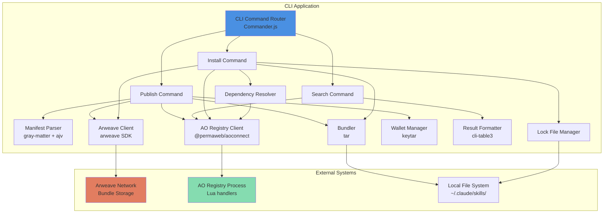

# Components

## CLI Command Router

**Responsibility:** Entry point for all user commands; parses arguments, routes to appropriate command handlers, and orchestrates error handling.

**Key Interfaces:**
- `CommandInterface` - Abstract interface all commands implement (execute, validate, help)
- CLI entry point: `skills <command> [args] [flags]`
- Global flags: `--verbose`, `--no-banner`, `--wallet <path>`

**Dependencies:**
- Commander.js for argument parsing
- All command modules (PublishCommand, SearchCommand, InstallCommand)
- Configuration loader for `.skillsrc` settings

**Technology Stack:**
- TypeScript
- Commander.js (^12.0.0)
- Chalk for colored output

**Component Files:**
```
cli/src/index.ts           # Entry point, commander setup
cli/src/commands/base.ts   # BaseCommand abstract class
```

## Publish Command Module

**Responsibility:** Handles `skills publish <directory>` workflow - validates manifest, bundles files, uploads to Arweave, registers in AO process.

**Key Interfaces:**
- `execute(directory: string, options: PublishOptions): Promise<PublishResult>`
- `PublishOptions`: { wallet?: string, verbose?: boolean }
- `PublishResult`: { txId: string, skillName: string, version: string }

**Dependencies:**
- Manifest Parser (validates SKILL.md)
- Bundler (creates tar.gz)
- Arweave Client (uploads bundle)
- AO Registry Client (registers metadata)
- Wallet Manager (loads keypair)

**Technology Stack:**
- TypeScript
- ora (progress spinners)
- chalk (success/error colors)

**Component Files:**
```
cli/src/commands/publish.ts
```

## Search Command Module

**Responsibility:** Handles `skills search <query>` workflow - queries AO registry, formats results as table.

**Key Interfaces:**
- `execute(query: string, options: SearchOptions): Promise<SearchResult[]>`
- `SearchOptions`: { tag?: string[], json?: boolean, verbose?: boolean }
- `SearchResult`: { name, author, version, description, tags }

**Dependencies:**
- AO Registry Client (Search-Skills query)
- Result Formatter (cli-table3 rendering)

**Technology Stack:**
- TypeScript
- cli-table3 (table rendering)
- chalk (colored output)

**Component Files:**
```
cli/src/commands/search.ts
cli/src/formatters/search-results.ts
```

## Install Command Module

**Responsibility:** Handles `skills install <name>` workflow - queries registry, downloads bundle, resolves dependencies, extracts files, updates lock file.

**Key Interfaces:**
- `execute(skillName: string, options: InstallOptions): Promise<InstallResult>`
- `InstallOptions`: { global?: boolean, local?: boolean, force?: boolean, verbose?: boolean }
- `InstallResult`: { installedSkills: string[], dependencyCount: number }

**Dependencies:**
- AO Registry Client (Get-Skill query)
- Arweave Client (bundle download)
- Dependency Resolver (recursive resolution)
- Bundle Extractor (tar.gz extraction)
- Lock File Manager (update skills-lock.json)

**Technology Stack:**
- TypeScript
- ora (progress indicators)
- tar (extraction)

**Component Files:**
```
cli/src/commands/install.ts
cli/src/lib/dependency-resolver.ts
```

## Manifest Parser

**Responsibility:** Extracts and validates YAML frontmatter from SKILL.md files against JSON schema.

**Key Interfaces:**
- `parse(skillMdPath: string): Promise<SkillManifest>`
- `validate(manifest: SkillManifest): ValidationResult`
- `SkillManifest` type matching data model

**Dependencies:**
- gray-matter (YAML parsing)
- ajv (JSON schema validation)
- File system (read SKILL.md)

**Technology Stack:**
- TypeScript
- gray-matter (^4.0.3)
- ajv (^8.12.0)

**Component Files:**
```
cli/src/parsers/manifest-parser.ts
cli/src/schemas/skill-manifest.schema.json
```

## Bundler

**Responsibility:** Creates tar.gz archives from skill directories, excluding unwanted files.

**Key Interfaces:**
- `bundle(directory: string): Promise<Buffer>`
- `extract(tarBuffer: Buffer, targetPath: string): Promise<void>`
- Exclusion patterns: `.git`, `node_modules`, hidden files

**Dependencies:**
- Node.js tar library
- File system traversal

**Technology Stack:**
- TypeScript
- tar (^6.2.0)

**Component Files:**
```
cli/src/lib/bundler.ts
```

## Arweave Client

**Responsibility:** Uploads bundles to Arweave, downloads bundles by TXID, checks wallet balance.

**Key Interfaces:**
- `uploadBundle(bundle: Buffer, metadata: BundleMetadata, wallet: JWK): Promise<string>`
- `downloadBundle(txId: string): Promise<Buffer>`
- `checkBalance(address: string): Promise<number>`

**Dependencies:**
- Arweave SDK (transaction creation)
- HTTP client (native fetch)

**Technology Stack:**
- TypeScript
- arweave (^1.14.4)
- Node.js native fetch

**Component Files:**
```
cli/src/clients/arweave-client.ts
```

## AO Registry Client

**Responsibility:** Sends messages to AO registry process, handles responses.

**Key Interfaces:**
- `registerSkill(metadata: SkillMetadata): Promise<void>`
- `searchSkills(query: string): Promise<SkillMetadata[]>`
- `getSkill(name: string): Promise<SkillMetadata>`
- `getRegistryInfo(): Promise<RegistryInfo>`

**Dependencies:**
- @permaweb/aoconnect (message passing)
- Configuration (registry process ID)

**Technology Stack:**
- TypeScript
- @permaweb/aoconnect (^0.0.53)

**Component Files:**
```
cli/src/clients/ao-registry-client.ts
```

## Dependency Resolver

**Responsibility:** Recursively resolves skill dependencies, detects circular dependencies, determines installation order via topological sorting.

**Key Interfaces:**
- `resolve(skillName: string): Promise<DependencyTree>`
- `detectCircular(tree: DependencyTree): CircularDependency[]`
- `topologicalSort(tree: DependencyTree): string[]`

**Dependencies:**
- AO Registry Client (fetch dependency metadata)

**Technology Stack:**
- TypeScript
- Graph traversal algorithms (DFS for circular detection, Kahn's algorithm for topological sort)

**Algorithm Specifications:**

### Circular Dependency Detection (DFS with Three-Color Marking)

```typescript
/**
 * Detects circular dependencies using DFS with color-based cycle detection
 *
 * Algorithm: Three-color marking
 * - WHITE (0): Unvisited node
 * - GRAY (1):  Currently visiting (in recursion stack)
 * - BLACK (2): Fully processed (all descendants visited)
 *
 * Circular dependency exists if we encounter a GRAY node during traversal
 * (indicates back edge to ancestor in current path)
 */

enum NodeColor {
  WHITE = 0,  // Unvisited
  GRAY = 1,   // In current path (recursion stack)
  BLACK = 2   // Fully processed
}
```

**Test Cases:**
- Simple cycle: A→B→A
- Three-node cycle: A→B→C→A
- Self-loop: A→A
- Diamond (no cycle): A→B, A→C, B→D, C→D
- Complex cycle: A→B→D→A, A→C→D

### Topological Sort (Kahn's Algorithm)

```typescript
/**
 * Determines correct installation order using Kahn's algorithm
 *
 * Algorithm: Process nodes with zero in-degree first
 * 1. Calculate in-degree (number of incoming edges) for each node
 * 2. Start with nodes that have zero in-degree (no dependencies)
 * 3. Remove each zero-degree node and decrease in-degree of neighbors
 * 4. Repeat until all nodes processed
 *
 * Result: Dependencies installed before dependents
 */
```

**Test Cases:**
- Linear chain: A→B→C→D
- Diamond: A→B, A→C, B→D, C→D
- Multiple roots: A→C, B→C, C→D
- Independent nodes: A, B, C (no dependencies)

**Performance Characteristics:**

| Operation | Time Complexity | Space Complexity |
|-----------|-----------------|------------------|
| Circular Detection (DFS) | O(V + E) | O(V) |
| Topological Sort (Kahn) | O(V + E) | O(V) |
| Full Resolution | O(V + E + N) | O(V) |

Where V = skills, E = dependency edges, N = network requests (cached)

**Component Files:**
```
cli/src/lib/dependency-resolver.ts
cli/src/lib/circular-detector.ts
cli/src/lib/topological-sorter.ts
```

## Lock File Manager

**Responsibility:** Reads and updates skills-lock.json with installation records.

**Key Interfaces:**
- `read(path: string): Promise<LockFile>`
- `update(skill: InstalledSkillRecord, path: string): Promise<void>`
- `merge(existingLock: LockFile, newSkills: InstalledSkillRecord[]): LockFile`

**Dependencies:**
- File system (JSON read/write)

**Technology Stack:**
- TypeScript
- Native JSON parsing

**Component Files:**
```
cli/src/lib/lock-file-manager.ts
```

## Wallet Manager

**Responsibility:** Loads Arweave keypairs from file system or system keychain, validates JWK format.

**Key Interfaces:**
- `load(walletPath: string): Promise<JWK>`
- `saveToKeychain(wallet: JWK, identifier: string): Promise<void>`
- `loadFromKeychain(identifier: string): Promise<JWK>`

**Dependencies:**
- keytar (system keychain)
- File system (JWK file reading)

**Technology Stack:**
- TypeScript
- keytar (^7.9.0) with file-based fallback

**Component Files:**
```
cli/src/lib/wallet-manager.ts
```

## AO Registry Process (Lua)

**Responsibility:** AO process maintaining skill registry state with author-based ownership control for updates and deletions.

**Key Interfaces:**
- Handler: `Register-Skill` - Adds skill to registry (stores `msg.From` as owner, enforces version bump for updates)
- Handler: `Search-Skills` - Queries registry by name/description/tags (public read)
- Handler: `Get-Skill` - Retrieves specific skill metadata (public read)
- Handler: `Info` - Returns registry metadata (ADP v1.0)

**Ownership Model:**
- `owner` field set to `msg.From` on initial registration (immutable)
- Updates require `msg.From == owner` and version bump
- Deletes require `msg.From == owner`

**Version Enforcement:**
- Updates must have `version > current version` (semantic version comparison)
- Prevents accidental overwrites
- Maintains version history integrity

**Dependencies:**
- AO runtime (ao.send, Handlers, json, **msg.From** for authorization)
- No external requires (monolithic design per AO best practices)

**Technology Stack:**
- Lua 5.3
- AO process runtime
- JSON encoding/decoding

**Component Files:**
```
ao-process/registry.lua
ao-process/tests/ownership-tests.lua
ao-process/tests/version-enforcement.test.lua
```

## Component Diagrams



---
