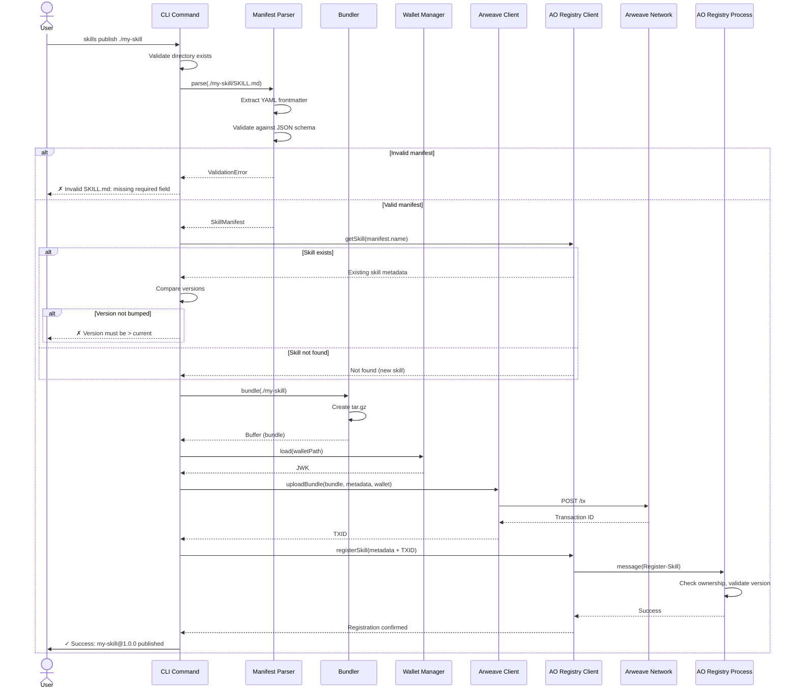
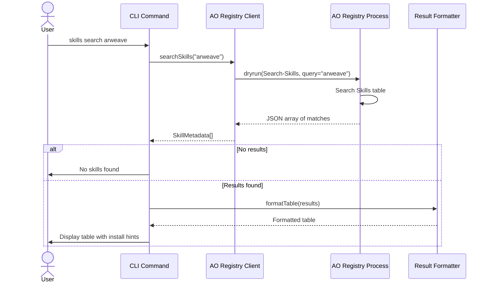
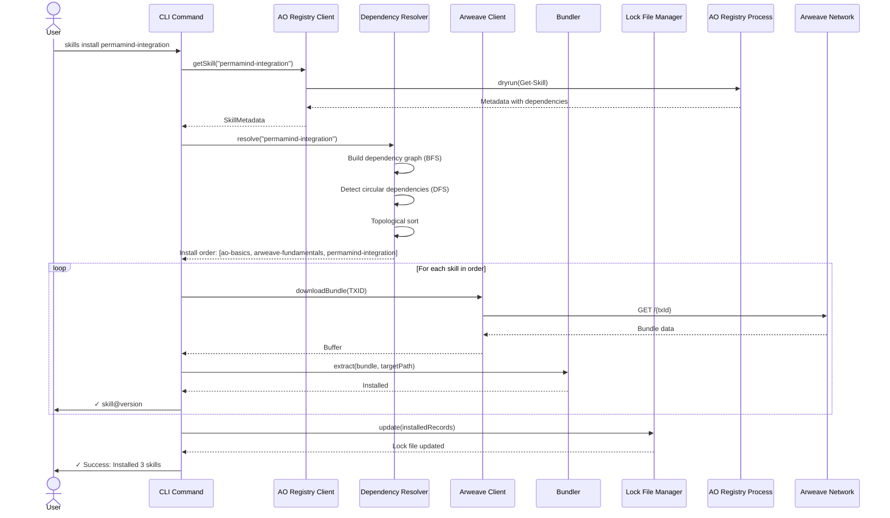

# Core Workflows

## Workflow 1: Publish Skill (New Registration)

```mermaid
sequenceDiagram
    actor User
    participant CLI as CLI Command
    participant Parser as Manifest Parser
    participant Bundler
    participant Wallet as Wallet Manager
    participant Arweave as Arweave Client
    participant AO as AO Registry Client
    participant ArweaveNet as Arweave Network
    participant AOProcess as AO Registry Process

    User->>CLI: skills publish ./my-skill
    CLI->>CLI: Validate directory exists
    CLI->>Parser: parse(./my-skill/SKILL.md)
    Parser->>Parser: Extract YAML frontmatter
    Parser->>Parser: Validate against JSON schema
    alt Invalid manifest
        Parser-->>CLI: ValidationError
        CLI-->>User: ✗ Invalid SKILL.md: missing required field
    else Valid manifest
        Parser-->>CLI: SkillManifest
        CLI->>AO: getSkill(manifest.name)
        alt Skill exists
            AO-->>CLI: Existing skill metadata
            CLI->>CLI: Compare versions
            alt Version not bumped
                CLI-->>User: ✗ Version must be > current
            end
        else Skill not found
            AO-->>CLI: Not found (new skill)
        end

        CLI->>Bundler: bundle(./my-skill)
        Bundler->>Bundler: Create tar.gz
        Bundler-->>CLI: Buffer (bundle)

        CLI->>Wallet: load(walletPath)
        Wallet-->>CLI: JWK
        CLI->>Arweave: uploadBundle(bundle, metadata, wallet)
        Arweave->>ArweaveNet: POST /tx
        ArweaveNet-->>Arweave: Transaction ID
        Arweave-->>CLI: TXID

        CLI->>AO: registerSkill(metadata + TXID)
        AO->>AOProcess: message(Register-Skill)
        AOProcess->>AOProcess: Check ownership, validate version
        AOProcess-->>AO: Success
        AO-->>CLI: Registration confirmed
        CLI->>User: ✓ Success: my-skill@1.0.0 published
    end
```

## Workflow 2: Search Skills

```mermaid
sequenceDiagram
    actor User
    participant CLI as CLI Command
    participant AO as AO Registry Client
    participant AOProcess as AO Registry Process
    participant Formatter as Result Formatter

    User->>CLI: skills search arweave
    CLI->>AO: searchSkills("arweave")
    AO->>AOProcess: dryrun(Search-Skills, query="arweave")
    AOProcess->>AOProcess: Search Skills table
    AOProcess-->>AO: JSON array of matches
    AO-->>CLI: SkillMetadata[]

    alt No results
        CLI->>User: No skills found
    else Results found
        CLI->>Formatter: formatTable(results)
        Formatter-->>CLI: Formatted table
        CLI->>User: Display table with install hints
    end
```

## Workflow 3: Install Skill with Dependencies

```mermaid
sequenceDiagram
    actor User
    participant CLI as CLI Command
    participant AO as AO Registry Client
    participant Resolver as Dependency Resolver
    participant Arweave as Arweave Client
    participant Bundler
    participant LockMgr as Lock File Manager
    participant AOProcess as AO Registry Process
    participant ArweaveNet as Arweave Network

    User->>CLI: skills install permamind-integration
    CLI->>AO: getSkill("permamind-integration")
    AO->>AOProcess: dryrun(Get-Skill)
    AOProcess-->>AO: Metadata with dependencies
    AO-->>CLI: SkillMetadata

    CLI->>Resolver: resolve("permamind-integration")
    Resolver->>Resolver: Build dependency graph (BFS)
    Resolver->>Resolver: Detect circular dependencies (DFS)
    Resolver->>Resolver: Topological sort
    Resolver-->>CLI: Install order: [ao-basics, arweave-fundamentals, permamind-integration]

    loop For each skill in order
        CLI->>Arweave: downloadBundle(TXID)
        Arweave->>ArweaveNet: GET /{txId}
        ArweaveNet-->>Arweave: Bundle data
        Arweave-->>CLI: Buffer

        CLI->>Bundler: extract(bundle, targetPath)
        Bundler-->>CLI: Installed
        CLI->>User: ✓ skill@version
    end

    CLI->>LockMgr: update(installedRecords)
    LockMgr-->>CLI: Lock file updated
    CLI->>User: ✓ Success: Installed 3 skills
```

---
