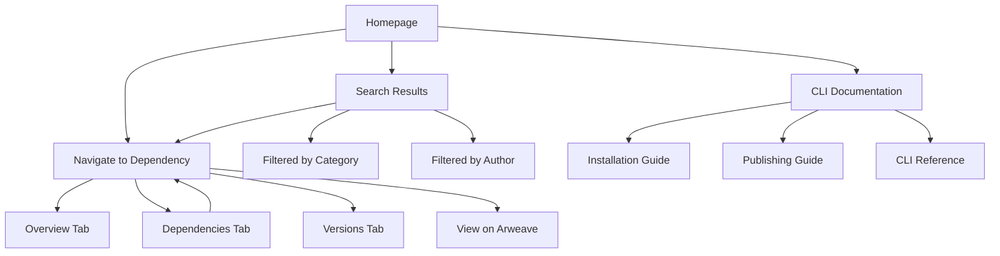
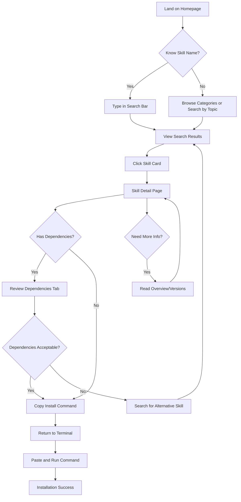
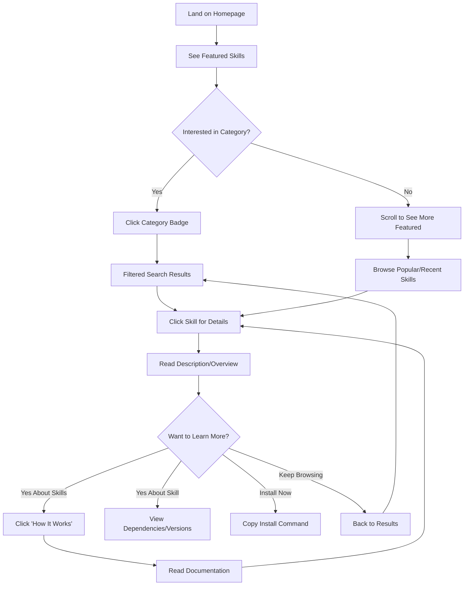
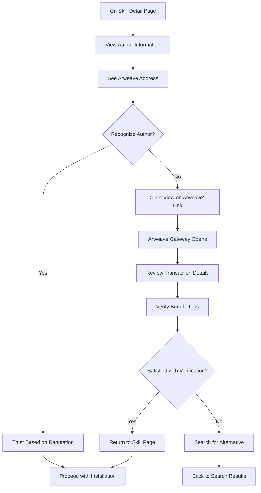

# Agent Skills Registry UI/UX Specification

## Introduction

This document defines the user experience goals, information architecture, user flows, and visual design specifications for Agent Skills Registry's user interface. It serves as the foundation for visual design and frontend development, ensuring a cohesive and user-centered experience.

### Overall UX Goals & Principles

#### Target User Personas

**1. AI Developer / Claude User**
- Technical professionals who use Claude Code and want to extend capabilities with agent skills
- Comfortable with CLI tools but appreciate visual discovery interfaces
- Need to quickly find relevant skills and understand dependencies before installing

**2. Skill Publisher**
- Developers creating agent skills for the community
- Want their skills to be discoverable with clear documentation
- Need visibility into skill adoption and usage patterns

**3. Curious Researcher**
- People exploring what's possible with agent skills
- May not have immediate installation needs
- Want to understand the ecosystem and browse capabilities

#### Usability Goals

1. **Rapid Discovery:** Users can find relevant skills within 30 seconds of landing on the site
2. **Clear Understanding:** Skill descriptions and dependencies are immediately comprehensible without reading documentation
3. **Seamless CLI Integration:** Copy-paste commands work first time, every time
4. **Progressive Learning:** New users understand basics immediately; power users discover advanced filtering quickly
5. **Trust & Transparency:** Arweave addresses, transaction IDs, and ownership are visible for verification

#### Design Principles

1. **Developer-First, Human-Friendly** - Technical accuracy without sacrificing approachability
2. **Search > Browse** - Optimize for finding specific skills over casual browsing
3. **CLI Companion, Not Replacement** - Surface information that helps CLI decisions, don't duplicate CLI functionality
4. **Decentralization Transparency** - Make the Arweave/AO infrastructure visible and understandable, not hidden
5. **Documentation is King** - Markdown rendering quality and readability trump visual flourishes

#### Change Log

| Date | Version | Description | Author |
|------|---------|-------------|--------|
| 2025-01-22 | 1.0 | Initial UI/UX specification | Sally (UX Expert) |

---

## Information Architecture (IA)

### Site Map / Screen Inventory

### Navigation Structure

**Primary Navigation (Global Header):**
- Logo/Home link (left)
- Search bar (center, always visible)
- "Browse" dropdown → Category filters
- "Documentation" link → CLI guides
- "Publish" link → Publishing guide
- "GitHub" link (external)

**Secondary Navigation (Contextual):**
- **Search Results:** Filter sidebar (desktop), Filter button (mobile) with sort options
- **Skill Detail:** Tab navigation (Overview, Dependencies, Versions)
- **Homepage:** Category quick-links (inline buttons/badges)

**Breadcrumb Strategy:**
- Homepage → No breadcrumbs
- Search Results → "Home / Search: [query]"
- Skill Detail → "Home / [Category] / [Skill Name]"
- CLI Docs → "Home / Documentation / [Page Title]"

---

## User Flows

### Flow 1: Discover and Install a Skill

**User Goal:** Find a skill that solves a specific need and install it via CLI

**Entry Points:**
- Homepage search bar
- Direct search engine result (Google → Skill detail page)
- Category browsing from homepage

**Success Criteria:** User successfully copies the install command and understands dependencies

#### Flow Diagram

#### Edge Cases & Error Handling

- Skill not found → Display "No results" with suggestions for similar skills
- Skill has circular dependencies → Show warning badge on Dependencies tab
- Skill requires deprecated dependency → Show warning with migration guide link
- Copy to clipboard fails (browser permission) → Show manual copy instructions with tooltip
- Arweave gateway timeout → Display cached metadata with "Last updated" timestamp

**Notes:** This flow assumes users are comfortable switching between browser and terminal. We should provide visual feedback when the install command is copied (toast notification: "Copied! Run this in your terminal").

---

### Flow 2: Browse and Explore the Ecosystem

**User Goal:** Understand what's available in the Agent Skills ecosystem without specific intent

**Entry Points:**
- Homepage hero section "Explore Skills" CTA
- Social media link or blog post
- First-time visitor curiosity

**Success Criteria:** User discovers interesting skills and understands the value proposition

#### Flow Diagram

#### Edge Cases & Error Handling

- No featured skills available → Show "Recently Published" skills instead
- Empty category clicked → Show message: "No skills in this category yet. Be the first to publish!"
- User clicks external Arweave link → Open in new tab with warning: "You're leaving the registry to view on Arweave"

**Notes:** We should track engagement metrics here (time on page, skills viewed) to optimize featured skill selection. Consider adding a "New to Agent Skills?" banner for first-time visitors.

---

### Flow 3: Verify Skill Authenticity & Ownership

**User Goal:** Confirm a skill is legitimate and from a trusted source before installing

**Entry Points:**
- Skill detail page after finding a skill
- Concern about malicious skills
- Verification requirement from security policy

**Success Criteria:** User understands who published the skill and can verify on Arweave

#### Flow Diagram

#### Edge Cases & Error Handling

- Arweave gateway is down → Show cached transaction metadata with "Gateway unavailable" warning
- Transaction ID invalid → Display error: "Unable to verify on Arweave. This skill may be compromised."
- User doesn't understand Arweave addresses → Show tooltip: "This is the permanent blockchain address of the publisher"

**Notes:** We should add a "Verified Publisher" badge system in post-MVP for known/trusted publishers. Consider showing publication date prominently as a trust signal (older skills = more battle-tested).

---

## Wireframes & Mockups

### Primary Design Files

**Design Tool:** Figma (recommended for web projects)
**File Structure:** Single Figma file with pages for: Homepage, Search Results, Skill Detail, Mobile Views
**Link:** [To be created - Placeholder for Figma project URL]

**Alternative Approach:** Since this is an AI-assisted project, you could generate initial wireframes using v0.dev or Lovable.ai, then refine in Figma for final designs.

---

### Key Screen Layouts

#### 1. Homepage (Desktop 1440px)

**Purpose:** Immediate access to search with featured skills to guide discovery

**Key Elements:**
- **Hero Section** (above fold):
  - Heading: "Discover Agent Skills for Claude" (text-hero, 2.5rem)
  - Subheading: Value proposition (1-2 sentences)
  - Search bar (full-width, 600px max, centered)
  - "Explore Skills" CTA button (secondary action)
- **Featured Skills Section**:
  - Section heading: "Featured Skills"
  - 3-column grid of SkillCard components
  - Each card: 320px width, 240px height
  - 6 skills visible (2 rows), "View All" link at bottom
- **Categories Section**:
  - Section heading: "Browse by Category"
  - 6-column grid of category badges with counts
  - Categories: "Blockchain", "Documentation", "Arweave", "AO Protocol", "CLI Tools", "AI Workflows"
- **How It Works Section** (optional):
  - 3 cards explaining: "1. Discover" → "2. Install via CLI" → "3. Activate in Claude"
- **Footer**:
  - "Powered by Arweave & AO" badge
  - Links: Documentation, GitHub, CLI Guide, Publish a Skill

**Interaction Notes:**
- Search bar has autofocus on page load
- Typing in search shows dropdown suggestions (after 3 characters)
- Category badges are clickable filters → navigate to search results
- All external links (GitHub, Arweave) open in new tabs

**Design File Reference:** [Figma: Homepage - Desktop Frame]

---

#### 2. Homepage (Mobile 375px)

**Purpose:** Same as desktop but optimized for touch and vertical scrolling

**Key Elements:**
- **Hero Section**:
  - Heading: Slightly smaller (text-h1, 2rem)
  - Search bar: Full width minus 16px padding
  - CTA button: Full width, stacked below search
- **Featured Skills**:
  - Single column layout
  - Card width: 100% of container (343px at 375px viewport)
  - Show 3 skills initially, "Load More" button
- **Categories**:
  - Horizontal scrollable row (hide scrollbar)
  - Each badge: min-width 120px, padding for touch targets
  - Snap-scroll behavior for smooth navigation

**Interaction Notes:**
- Search bar expands on focus (pushes other elements down)
- Swipe gestures for category scrolling
- Pull-to-refresh for updated featured skills (optional)

**Design File Reference:** [Figma: Homepage - Mobile Frame]

---

#### 3. Search Results (Desktop)

**Purpose:** Filter and browse search results efficiently with context

**Key Elements:**
- **Header**: Global navigation (sticky)
- **Results Header Bar**:
  - "X skills found for '[query]'" (left)
  - Sort dropdown: "Relevance", "Most Popular", "Recently Updated", "A-Z" (right)
  - View toggle: Grid/List icons (right, next to sort)
- **Left Sidebar** (25% width):
  - **Filter by Category** (checkboxes)
  - **Filter by Author** (text input with search icon)
  - **Clear Filters** button (bottom)
- **Main Results Area** (75% width):
  - 2-column grid of SkillCard components
  - 12 skills per page
  - Pagination controls at bottom (numbered pages + next/prev)
  - Empty state: "No skills found" with suggestions

**Interaction Notes:**
- Filters update results instantly (no "Apply" button needed)
- Selected filters show as dismissible badges above results
- Clicking a category filter adds it (multi-select)
- Sort dropdown updates URL query parameter

**Design File Reference:** [Figma: Search Results - Desktop Frame]

---

#### 4. Search Results (Mobile)

**Purpose:** Streamlined filtering with focus on results

**Key Elements:**
- **Header**: Search bar + Filter button (hamburger icon)
- **Results Count**: "X skills found" (small text, top of list)
- **Results List**: Single column, full-width cards
- **Filter Drawer** (slides in from bottom):
  - Category checkboxes
  - Author search input
  - Sort radio buttons
  - "Apply Filters" button (primary, full-width)
  - "Clear All" link

**Interaction Notes:**
- Filter button shows badge with count of active filters
- Drawer has backdrop overlay (dimmed background)
- Swipe down or tap backdrop to close drawer
- Results update after "Apply Filters" is clicked

**Design File Reference:** [Figma: Search Results - Mobile Frame]

---

#### 5. Skill Detail Page (Desktop)

**Purpose:** Complete skill information with clear install path

**Key Elements:**
- **Header Section** (sticky):
  - Skill name (text-h1)
  - Author with Arweave address (abbreviated: abc...xyz)
  - Metadata badges: Version, License, Published date
- **Action Bar** (sticky below header):
  - "Install via CLI" button (primary, copies command)
  - "View on Arweave" button (secondary, opens new tab)
  - Share icon (copies page URL)
- **Main Content Area** (70% width):
  - **Tabs Navigation**: Overview | Dependencies | Versions
  - **Overview Tab Content**:
    - Description section (markdown rendered)
    - Tags (all badges visible)
    - "Quick Start" code block with install command
  - **Dependencies Tab Content**:
    - Tree view component (nested list)
    - Each dependency: Name (link) → Version badge
    - Empty state: "No dependencies"
  - **Versions Tab Content**:
    - Table: Version | Published Date | Arweave TXID
    - Current version has "Latest" badge
- **Right Sidebar** (30% width, sticky):
  - Statistics card: Downloads (mocked), Dependencies count
  - Author card: Name, Address (abbreviated), "View all by author" link
  - Tags card: All tags as clickable badges
  - Install instructions card: Copy-pasteable command

**Interaction Notes:**
- Tabs use hash routing (#overview, #dependencies, #versions)
- Markdown links open in new tabs
- Code blocks have hover "Copy" button (top-right corner)
- Dependency tree items are collapsible (nested dependencies)
- Clicking tag badge navigates to filtered search

**Design File Reference:** [Figma: Skill Detail - Desktop Frame]

---

#### 6. Skill Detail Page (Mobile)

**Purpose:** Same information, optimized for single-column scrolling

**Key Elements:**
- **Header**: Skill name + back button
- **Metadata Section**: Version, Author, License (stacked)
- **Action Buttons** (sticky at bottom):
  - "Install via CLI" (primary, full-width)
  - "View on Arweave" (secondary, full-width)
- **Tabs**: Horizontal scrollable (Overview | Dependencies | Versions)
- **Tab Content**: Full-width, scrolls naturally
- **Statistics/Author Info**: Inline within Overview tab (not sidebar)

**Interaction Notes:**
- Sticky bottom bar for actions (always accessible)
- Swipe between tabs (optional gesture support)
- "Install" button triggers copy + shows toast notification
- Long-press on code blocks for copy options

**Design File Reference:** [Figma: Skill Detail - Mobile Frame]

---

## Component Library / Design System

### Design System Approach

**Primary Strategy:** Use shadcn/ui v4 as the foundational component library with Tailwind CSS for styling. This provides:
- Pre-built, accessible React components
- Customizable via Tailwind theme configuration
- Copy-paste architecture (components live in your codebase, not node_modules)
- Consistent with modern web development practices

**Customization Level:** Medium - We'll use shadcn/ui components as-is for 80% of UI needs, creating custom composite components for domain-specific patterns (SkillCard, DependencyTree, MarkdownRenderer).

**Theme Extension:** Extend shadcn/ui's default theme with custom color palette inspired by Docker Hub/Notion while maintaining WCAG AA accessibility standards.

---

### Core Components

#### 1. SkillCard

**Purpose:** Display skill metadata in a consistent, scannable format across search results and featured sections

**Variants:**
- **Default (Grid)**: Fixed width (320px), fixed height (240px), optimized for 2-3 column grids
- **List**: Full width, variable height, horizontal layout with thumbnail
- **Compact**: Smaller dimensions (280x200px) for dense featured sections

**States:**
- **Default**: Neutral background, subtle border
- **Hover**: Elevated shadow, gradient border (teal-to-blue), cursor pointer
- **Loading**: Skeleton placeholder (shadcn Skeleton component)
- **Error**: Red border, error icon, fallback text

**Usage Guidelines:**
- Always truncate description to 3 lines maximum (CSS `-webkit-line-clamp`)
- Show maximum 3 tags; if more exist, display "+X more" badge
- Clicking anywhere on card navigates to skill detail page
- Badge hierarchy: Version (primary) → License (secondary) → Author (tertiary)

---

#### 2. SearchBar

**Purpose:** Primary discovery mechanism with instant feedback and keyboard shortcuts

**Variants:**
- **Hero** (Homepage): Large, centered, with prominent styling
- **Header** (Global): Compact, left-aligned in navigation bar
- **Mobile**: Expandable on focus, full-width overlay

**States:**
- **Empty**: Placeholder text "Search agent skills..."
- **Focused**: Highlighted border, magnifying glass icon (lucide-react)
- **Typing**: Clear button (X icon) appears on right
- **Suggestions Active**: Dropdown with autocomplete results (max 5 suggestions)
- **Loading**: Spinner icon replaces magnifying glass
- **Disabled**: Grayed out (used during error states)

**Usage Guidelines:**
- Debounce input by 300ms to reduce AO query load
- Keyboard shortcut: Cmd/Ctrl+K focuses search from anywhere
- ESC key clears input and closes suggestions dropdown
- Arrow keys navigate suggestions, Enter selects
- Minimum 3 characters before showing suggestions

---

#### 3. Button (shadcn/ui base + custom variants)

**Purpose:** Standard actions throughout the application

**Variants:**
- **Primary**: Bold, filled background (primary color), used for main CTAs ("Install via CLI")
- **Secondary**: Outlined, transparent background, used for alternative actions ("View on Arweave")
- **Ghost**: No border, minimal styling, used for tertiary actions (footer links)
- **Icon**: Square, icon-only, used for compact actions (copy button, share)
- **Destructive**: Red color scheme, used for warnings (not common in this app)

**States:**
- Default, Hover (darkened), Active (pressed), Disabled (grayed, no interaction), Loading (spinner)

**Usage Guidelines:**
- Primary buttons should be limited to 1-2 per screen
- Icon buttons must include aria-label for accessibility
- Loading state shows spinner inside button, text changes to "Loading..."
- Never use all-caps text (against modern design trends)

---

#### 4. Badge

**Purpose:** Display metadata tags, status indicators, and category labels

**Variants:**
- **Default**: Neutral gray background, dark text
- **Primary**: Primary color background, white text (for active categories)
- **Success**: Green background (for "Latest" version indicator)
- **Warning**: Amber background (for deprecation warnings)
- **Outline**: Border only, transparent background (for clickable tags)

**States:**
- Default, Hover (slightly darker if clickable), Active (primary variant)

**Usage Guidelines:**
- Use outline variant for tags that are clickable filters
- Use solid variant for non-interactive metadata display
- Keep text concise (1-3 words max)
- Version badges format: "v1.2.3" (include 'v' prefix)
- Count badges format: "+3 more" (use plus symbol)

---

#### 5. Card (shadcn/ui base)

**Purpose:** Container for grouped content (skill cards, sidebar widgets, statistics panels)

**Variants:**
- **Default**: White background, subtle border, 8px border-radius
- **Elevated**: Adds shadow, used for interactive elements
- **Flat**: No border, no shadow, used for tight groupings

**States:**
- Default, Hover (if clickable, adds elevation)

**Usage Guidelines:**
- Padding: 16px (mobile), 24px (desktop)
- Always use semantic HTML (<article> for skill cards, <aside> for sidebars)
- Maintain consistent spacing between cards (16px gap in grids)

---

#### 6. Table (shadcn/ui base)

**Purpose:** Display structured data (version history, search results in list view)

**Variants:**
- **Default**: Striped rows, bordered
- **Compact**: Reduced padding for dense information
- **Hoverable**: Highlight row on hover

**States:**
- Default, Hover (highlight row), Loading (skeleton rows)

**Usage Guidelines:**
- Always include sortable column headers where appropriate
- Mobile: Convert to card-based layout (avoid horizontal scrolling)
- Maximum 5 columns on desktop, 2-3 on mobile
- Include pagination for datasets > 20 rows

---

#### 7. Tabs (shadcn/ui base)

**Purpose:** Organize content sections (Overview/Dependencies/Versions on skill detail page)

**Variants:**
- **Line**: Underline indicator (default)
- **Pills**: Rounded background indicator (alternative)

**States:**
- Default, Active (highlighted), Hover (subtle highlight)

**Usage Guidelines:**
- Limit to 3-5 tabs maximum for cognitive load
- On mobile, use horizontal scroll if > 3 tabs
- Active tab should be visually distinct (not just color)
- Use hash routing for deep-linking (#overview, #dependencies)

---

#### 8. MarkdownRenderer (Custom Component)

**Purpose:** Render SKILL.md content with consistent styling and interactive features

**Variants:**
- **Full** (Detail page): All markdown features enabled
- **Preview** (Search results): Limited to text, links, basic formatting

**States:**
- Default, Loading (skeleton), Error (fallback message)

**Usage Guidelines:**
- Max content width: 65ch for optimal readability
- Code blocks: Syntax highlighting with copy button (top-right)
- Links: External links open in new tab with icon indicator
- Headings: Automatic anchor links for navigation
- Images: Lazy load, max-width 100%, add captions via alt text
- Line height: 1.7 for body text (Notion-inspired readability)
- Code blocks: Background #F6F8FA, 4px border-radius, padding 16px

---

#### 9. CopyButton (Custom Component)

**Purpose:** One-click copy functionality for install commands and code snippets

**Variants:**
- **Inline** (within code blocks): Icon button, top-right corner
- **Primary** (action button): Full button with "Copy Install Command" text

**States:**
- Default (clipboard icon), Hover (highlighted), Success (checkmark icon, 2s timeout), Error (X icon)

**Usage Guidelines:**
- Show toast notification on successful copy: "Copied to clipboard!"
- Fallback for browsers without clipboard API: Select text automatically with tooltip
- Success state automatically reverts to default after 2 seconds
- Include aria-live region for screen reader announcements

---

#### 10. FilterSidebar (Custom Component)

**Purpose:** Multi-faceted filtering for search results (desktop only)

**Variants:**
- **Expanded** (default): All filter groups visible
- **Collapsed** (mobile): N/A - use drawer instead

**States:**
- Default, Loading (disabled with spinner), Empty (no options available)

**Usage Guidelines:**
- Each filter group collapsible independently
- Active filters show count badge in group header
- "Clear All" button only visible when filters are active
- Checkbox filters allow multi-select
- Text input filters debounce by 500ms

---

## Branding & Style Guide

### Visual Identity

**Brand Guidelines:** This is a community-driven open-source project without formal corporate branding. The visual identity should convey:
- **Technical Credibility** - Professional, developer-focused aesthetic
- **Decentralization** - References to Arweave/AO infrastructure
- **Approachability** - Modern, clean design that doesn't intimidate newcomers
- **Permanence** - Visual stability matching blockchain permanence concept

**Logo/Wordmark:** "Agent Skills Registry" wordmark (no complex logo needed for MVP). Use monospace or technical sans-serif font. Consider adding a subtle Arweave/AO reference in footer only.

---

### Color Palette

| Color Type | Hex Code | Usage |
|------------|----------|-------|
| **Primary** | `#1D63ED` | Primary actions (Install buttons), active states, links, focus indicators |
| **Primary Hover** | `#1557D6` | Hover state for primary buttons |
| **Secondary** | `#4A90E2` | Secondary actions, informational elements |
| **Accent Teal** | `#00A58C` | Success states, positive feedback, verified badges |
| **Accent Red** | `#E65264` | Errors, destructive actions, critical warnings |
| **Accent Amber** | `#DB7512` | Warnings, deprecation notices, cautions |
| **Neutral Darkest** | `#10151B` | Primary text, headings on light backgrounds |
| **Neutral Dark** | `#333333` | Secondary text, body copy |
| **Neutral Medium** | `#6B7280` | Tertiary text, placeholders, disabled states |
| **Neutral Light** | `#E5E7EB` | Borders, dividers, subtle backgrounds |
| **Neutral Lightest** | `#F9FAFB` | Page background, card backgrounds |
| **White** | `#FFFFFF` | Component backgrounds, primary surface color |
| **Code Block BG** | `#F6F8FA` | Code block backgrounds, inline code |

**Accessibility Notes:**
- All color combinations tested meet WCAG AA standards (4.5:1 contrast minimum)
- Primary on white: 4.52:1 ratio ✓
- Neutral Dark on white: 12.6:1 ratio ✓
- Never rely on color alone to convey information (use icons + text)

---

### Typography

#### Font Families

- **Primary:** Inter (sans-serif) - Modern, highly legible, excellent hinting for screens
  - Fallback: -apple-system, BlinkMacSystemFont, "Segoe UI", Roboto, system-ui
  - Use Variable Font for optimal performance (Inter Variable)
- **Secondary:** System UI Stack (for UI elements)
  - Same as fallback chain above
- **Monospace:** JetBrains Mono (for code blocks, install commands)
  - Fallback: 'Courier New', Courier, monospace
  - Ligatures enabled for better code readability

**Font Loading Strategy:** Use `font-display: swap` to prevent FOIT (Flash of Invisible Text). Load Inter via Google Fonts or self-host for Arweave deployment.

---

#### Type Scale

| Element | Size | Weight | Line Height | Usage |
|---------|------|--------|-------------|-------|
| **H1** | 2rem (32px) | 600 (SemiBold) | 1.2 (38px) | Page titles, skill names on detail pages |
| **H2** | 1.5rem (24px) | 600 (SemiBold) | 1.3 (31px) | Section headings, card titles |
| **H3** | 1.25rem (20px) | 600 (SemiBold) | 1.4 (28px) | Subsection headings, component titles |
| **Body** | 1rem (16px) | 400 (Regular) | 1.6 (25.6px) | Paragraphs, descriptions, general text |
| **Body Bold** | 1rem (16px) | 500 (Medium) | 1.6 (25.6px) | Emphasis, labels |
| **Small** | 0.875rem (14px) | 400 (Regular) | 1.5 (21px) | Metadata, captions, secondary info |
| **Tiny** | 0.75rem (12px) | 500 (Medium) | 1.4 (16.8px) | Badges, tags, timestamps |
| **Code Inline** | 0.875rem (14px) | 400 (Regular) | 1.6 (22.4px) | Inline code snippets |
| **Code Block** | 0.875rem (14px) | 400 (Regular) | 1.7 (23.8px) | Code blocks, terminal commands |

**Mobile Adjustments:**
- H1 scales down to 1.75rem (28px) on screens < 640px
- Body text remains 1rem (readability priority)
- Reduce line-height slightly on mobile (1.5 instead of 1.6) to reduce vertical scrolling

---

### Iconography

**Icon Library:** Lucide React (https://lucide.dev)

**Rationale:** Lucide provides:
- Consistent line weight (2px stroke)
- Tree-shakeable imports (only bundle icons you use)
- React-optimized components
- Large icon set (1000+ icons)
- MIT license, actively maintained

**Usage Guidelines:**
- Default size: 20px (for body text context)
- Button icons: 16px
- Hero/large icons: 32px or 48px
- Always include aria-hidden="true" for decorative icons
- Use aria-label on icon-only buttons
- Color: Match surrounding text color (currentColor)

**Common Icons:**
- Search: `Search` icon
- Copy: `Copy` icon → `Check` icon (success state)
- External link: `ExternalLink` icon
- Navigation: `ChevronRight`, `ChevronLeft`
- Actions: `Download`, `Upload`, `Share2`
- Status: `AlertCircle` (error), `CheckCircle2` (success), `AlertTriangle` (warning)

---

### Spacing & Layout

**Grid System:**
- CSS Grid for page layouts (header, sidebar, main content)
- Flexbox for component layouts (cards, buttons, inline elements)
- No traditional 12-column grid needed (modern CSS is more flexible)

**Container Widths:**
- Max content width: 1280px (centered on ultra-wide screens)
- Content column: 800px max for text-heavy content (readability)
- Sidebar: 280px on desktop
- Mobile: 100% width with 16px padding

**Spacing Scale (Tailwind default):**
- 4px base unit (0.25rem)
- Scale: 4, 8, 12, 16, 20, 24, 32, 40, 48, 64, 80, 96, 128px
- Component internal padding: 16px (mobile), 24px (desktop)
- Section vertical spacing: 48px (mobile), 64px (desktop)
- Grid gaps: 16px (mobile), 24px (desktop)

**Border Radius:**
- Small (badges, tags): 4px
- Default (buttons, cards): 8px
- Large (modals, images): 12px
- Full (avatars, icon buttons): 9999px

**Shadows (Tailwind naming):**
- `shadow-sm`: Subtle elevation (0 1px 2px rgba(0,0,0,0.05))
- `shadow`: Default elevation (0 1px 3px rgba(0,0,0,0.1))
- `shadow-md`: Medium elevation for cards (0 4px 6px rgba(0,0,0,0.1))
- `shadow-lg`: High elevation for modals/dropdowns (0 10px 15px rgba(0,0,0,0.1))

---

## Accessibility Requirements

### Compliance Target

**Standard:** WCAG 2.1 Level AA

**Rationale:** Level AA is the industry standard and legally required in many jurisdictions. Level AAA requirements are often impractical for rich web applications. WCAG 2.1 includes mobile-specific criteria that 2.0 lacks.

**Scope:** All public-facing pages and interactive components must meet AA standards. This includes:
- Homepage
- Search results
- Skill detail pages
- Navigation elements
- All form inputs (search bars, filters)

---

### Key Requirements

#### Visual

**Color Contrast Ratios:**
- Normal text (< 18pt): Minimum 4.5:1 contrast ratio
- Large text (≥ 18pt or 14pt bold): Minimum 3:1 contrast ratio
- UI components and graphical objects: Minimum 3:1 contrast ratio
- Active/focus states: Must maintain contrast ratios
- **Testing Strategy:** Use Chrome DevTools Lighthouse audit + manual verification with WebAIM Contrast Checker

**Focus Indicators:**
- All interactive elements must have visible focus indicator
- Focus ring: 2px solid primary color (#1D63ED) with 2px offset
- Focus ring must have 3:1 contrast against both background and element
- Never remove outline without providing alternative (e.g., `outline: none` without replacement is forbidden)
- Skip-to-content link for keyboard users (appears on Tab press)

**Text Sizing:**
- All text must be resizable up to 200% without loss of functionality
- Use relative units (rem, em) instead of fixed pixels for font sizes
- No horizontal scrolling at 200% zoom (responsive reflow)
- Minimum touch target size: 44x44px (WCAG 2.1 Level AAA, but achievable for buttons)

---

#### Interaction

**Keyboard Navigation:**
- All functionality accessible via keyboard alone (no mouse required)
- Logical tab order following visual layout
- Custom components (tabs, modals, dropdowns) must manage focus correctly
- Escape key closes modals/dropdowns and returns focus
- Arrow keys navigate within component groups (tabs, radio buttons)
- Enter/Space activates buttons and links
- **Testing Strategy:** Complete all user flows using only keyboard (Tab, Shift+Tab, Enter, Space, Arrow keys, Escape)

**Screen Reader Support:**
- Semantic HTML elements (nav, main, article, aside, footer, header)
- ARIA landmarks where semantic HTML insufficient
- ARIA labels for icon-only buttons (`aria-label="Copy install command"`)
- ARIA live regions for dynamic content (toast notifications: `aria-live="polite"`)
- ARIA expanded/collapsed states for accordions and dropdowns
- ARIA current for navigation highlighting (`aria-current="page"`)
- Skip navigation link for screen reader users
- **Testing Strategy:** Test with NVDA (Windows), JAWS (Windows), VoiceOver (macOS/iOS), TalkBack (Android)

**Touch Targets:**
- Minimum size: 44x44px for all interactive elements
- Adequate spacing: Minimum 8px between adjacent touch targets
- Larger targets for primary actions (48x48px or larger)
- **Testing Strategy:** Test on actual mobile devices (iOS Safari, Android Chrome)

---

#### Content

**Alternative Text:**
- All images must have alt text (or empty alt="" if decorative)
- Alt text describes image content/purpose, not "image of..."
- Complex graphics (diagrams) need longer descriptions via aria-describedby
- Icon-only buttons use aria-label (not alt)
- **Testing Strategy:** Automated scan with axe DevTools + manual review

**Heading Structure:**
- One H1 per page (page title)
- Logical heading hierarchy (H2 → H3, never skip levels)
- Headings describe content that follows
- No empty headings or headings used for styling only
- **Testing Strategy:** Outline view in HeadingsMap browser extension

**Form Labels:**
- Every input has an associated label (via `<label for="">` or aria-label)
- Placeholder text does not replace labels
- Error messages linked to inputs (aria-describedby)
- Required fields indicated visually and programmatically (aria-required="true")
- Group related inputs (e.g., filters) with fieldset/legend
- **Testing Strategy:** Automated scan + manual keyboard-only form completion

---

### Testing Strategy

**Automated Testing (Run on every build):**
1. **axe DevTools** (browser extension) - Scans for WCAG violations
2. **Lighthouse Accessibility Audit** (Chrome DevTools) - Scores 0-100, target ≥90
3. **Pa11y CI** (command line) - Automated testing in CI/CD pipeline
4. **ESLint jsx-a11y plugin** - Catch accessibility issues during development

**Manual Testing (Run before releases):**
1. **Keyboard Navigation Test:**
   - Complete all user flows using only keyboard
   - Verify focus indicators are always visible
   - Confirm logical tab order
2. **Screen Reader Test:**
   - Test with at least 2 screen readers (NVDA + VoiceOver minimum)
   - Verify all content is announced correctly
   - Confirm ARIA labels are meaningful
3. **Zoom Test:**
   - Zoom to 200% and verify no content is cut off
   - Test responsive reflow at high zoom levels
4. **Color Contrast Test:**
   - Verify all text meets 4.5:1 ratio (or 3:1 for large text)
   - Test in grayscale mode to verify color isn't sole differentiator
5. **Mobile Touch Test:**
   - Test on real devices (not just emulators)
   - Verify all buttons are easily tappable (44x44px min)

**User Testing (Optional but recommended):**
- Test with users who rely on assistive technologies
- Gather feedback from developers with disabilities (our target audience)
- Address usability issues beyond technical compliance

**Documentation:**
- Maintain accessibility checklist in GitHub (reference above tests)
- Log accessibility issues in dedicated GitHub label
- Include accessibility testing in PR review template

---

## Responsiveness Strategy

### Breakpoints

| Breakpoint | Min Width | Max Width | Target Devices |
|------------|-----------|-----------|----------------|
| **Mobile** | 320px | 639px | iPhone SE, iPhone 12/13/14, Android phones, small devices |
| **Tablet** | 640px | 1023px | iPad Mini, iPad, iPad Air, Android tablets, large phones in landscape |
| **Desktop** | 1024px | 1439px | Laptops, small desktop monitors, MacBook Air/Pro 13" |
| **Wide** | 1440px | - | Large monitors, iMac, MacBook Pro 16", external displays |

**Rationale:** These breakpoints align with Tailwind CSS defaults (sm: 640px, md: 768px, lg: 1024px, xl: 1280px, 2xl: 1536px) but simplified to 4 categories for clearer design decisions. The 320px minimum ensures support for older small devices.

---

### Adaptation Patterns

#### Layout Changes

**Mobile (320px - 639px):**
- Single-column layout throughout
- No sidebars (convert to drawers or inline sections)
- Full-width components with 16px horizontal padding
- Stack elements vertically (search bar, buttons, cards)
- Hero section: Reduced height, vertical layout
- Featured skills: 1 column grid
- Categories: Horizontal scrollable row

**Tablet (640px - 1023px):**
- 2-column grid for skill cards
- Sidebar remains as drawer for filters (not enough horizontal space)
- Hero section: Can use 2-column layout if content permits
- Search bar: Centered, max-width 600px
- Modal/dialog: 80% width instead of full-width

**Desktop (1024px - 1439px):**
- 3-column grid for skill cards on homepage
- 2-column grid for search results (with sidebar)
- Left sidebar (280px) for filters on search page
- Right sidebar (30% width) for metadata on skill detail page
- Hero section: 2-column horizontal layout
- Max content width: 1280px (centered)

**Wide (1440px+):**
- Same layout as desktop but with more generous spacing
- Max content width remains 1280px (prevent excessive line lengths)
- Larger images/visual elements where appropriate
- Consider 4-column grid for homepage featured section

---

#### Navigation Changes

**Mobile:**
- Hamburger menu icon (top-right) opens navigation drawer
- Navigation drawer slides from right, includes:
  - Search bar (if not already in header)
  - Browse categories (expandable list)
  - Documentation link
  - GitHub link
- Search bar can be sticky header (always visible)
- Breadcrumbs: Hidden or simplified to back button only

**Tablet:**
- Hybrid approach: Primary nav in header, secondary in drawer
- Search bar always visible in header (centered)
- "Browse" and "Documentation" links visible in header
- Breadcrumbs: Full display

**Desktop/Wide:**
- Full horizontal navigation bar
- All primary links visible (no hamburger menu)
- Search bar centered, approximately 600px wide
- Dropdown menus for "Browse" (shows categories)
- Breadcrumbs: Full display with separators

---

#### Content Priority

**Mobile (Information Hierarchy):**
1. **Most Important:** Search bar, primary CTA, skill name/description
2. **Secondary:** Key metadata (version, author), install command
3. **Tertiary:** Extended descriptions, dependencies, version history
4. **Hidden/Deferred:** Detailed documentation, related skills, footer content

**Adaptation Strategy:**
- Use progressive disclosure (expand/collapse sections)
- Tabs for organizing secondary content (Overview/Dependencies/Versions)
- "Show More" buttons for long descriptions
- Truncate lists (show 3 items + "View All" link)

**Tablet:**
- Slightly more content visible (2-column layouts allow side-by-side comparisons)
- Less aggressive truncation
- Tabs remain but with more space

**Desktop/Wide:**
- All content visible without excessive scrolling
- Side-by-side comparisons (e.g., skill card grids)
- Less reliance on progressive disclosure

---

#### Interaction Changes

**Mobile:**
- **Touch-Optimized:**
  - Minimum touch targets: 44x44px (WCAG AAA)
  - Increased padding around interactive elements
  - Swipe gestures for carousels (category badges)
  - Pull-to-refresh for search results (optional)
- **Tap vs. Hover:**
  - No hover states (use active/pressed states instead)
  - Tooltips: Convert to tap-to-show or remove entirely
  - Dropdown menus: Open on tap, remain open until dismissed
- **Modal Behavior:**
  - Full-screen modals (not centered dialogs)
  - Bottom sheets for filters and actions
  - Slide-in animations from bottom or side

**Tablet:**
- Hybrid touch + cursor support
- Slightly smaller touch targets acceptable (40x40px minimum)
- Hover states work but shouldn't be required
- Modals: 80% screen width, centered with backdrop

**Desktop:**
- **Cursor-Optimized:**
  - Hover states for all interactive elements
  - Tooltips appear on hover (200ms delay)
  - Dropdown menus open on hover (with slight delay)
  - Click required for final actions (hover alone doesn't submit)
- **Keyboard Shortcuts:**
  - Cmd/Ctrl+K focuses search
  - Tab navigation emphasized
  - Arrow keys for component navigation
- **Mouse Interactions:**
  - Double-click to copy code blocks (in addition to button)
  - Right-click context menus (optional enhancement)

---

## Animation & Micro-interactions

### Motion Principles

**1. Purpose-Driven Animation**
- Every animation must serve a functional purpose (feedback, guidance, or context)
- Never animate purely for decoration
- Animation enhances understanding, doesn't distract

**2. Subtle and Fast**
- Prefer short durations (150-300ms) over long animations (500ms+)
- Users should barely notice the motion but feel the smoothness
- Avoid bouncy, elastic, or exaggerated easing

**3. Respect User Preferences**
- Honor `prefers-reduced-motion` media query
- Users who enable reduced motion see instant transitions (0ms duration)
- Critical for accessibility (vestibular disorders, motion sensitivity)

**4. Performance First**
- Animate only transform and opacity (GPU-accelerated properties)
- Avoid animating width, height, top, left, margin (causes layout reflow)
- Use `will-change` sparingly and remove after animation completes

**5. Consistent Timing**
- Use standardized duration/easing combinations across the app
- Create a motion design token system (like color palette)

---

### Key Animations

- **Page Transitions:** Fade-in effect when navigating between pages (Duration: 200ms, Easing: ease-out)
- **Card Hover Elevation:** Skill cards lift and show shadow on hover (Duration: 150ms, Easing: ease-out)
- **Button Press:** Scale down slightly on click for tactile feedback (Duration: 100ms, Easing: ease-in-out)
- **Toast Notification:** Slide in from top-right, pause, then fade out (Duration: Slide in 200ms, Display 3000ms, Fade out 300ms)
- **Modal/Dialog Open:** Backdrop fades in, modal scales up from 95% to 100% (Duration: 200ms, Easing: ease-out)
- **Drawer Slide (Mobile Filter):** Drawer slides in from bottom with backdrop fade (Duration: 250ms, Easing: cubic-bezier(0.4, 0, 0.2, 1))
- **Skeleton Loading:** Shimmer effect across skeleton placeholder (Duration: 1500ms continuous loop)
- **Copy Button Success State:** Icon changes from clipboard to checkmark with brief scale pulse (Duration: Icon change 150ms, Scale pulse 200ms, Revert after 2000ms)
- **Search Suggestions Dropdown:** Fade in and slight downward motion (Duration: 150ms, Easing: ease-out)
- **Accordion/Collapsible Expand:** Smooth height expansion with content fade-in (Duration: 250ms, Easing: ease-out)
- **Focus Ring Appearance:** Subtle pulse when element receives keyboard focus (Duration: 200ms one-time, Easing: ease-out)
- **Loading Spinner:** Rotating spinner icon (Duration: 800ms per rotation continuous, Easing: linear)

---

## Performance Considerations

### Performance Goals

- **Page Load (Initial):** First Contentful Paint (FCP) < 1.5s on 3G connection
- **Page Load (Full):** Time to Interactive (TTI) < 3.5s on 3G connection
- **Interaction Response:** Click to visual feedback < 100ms
- **Animation FPS:** Maintain 60fps for all animations (16.67ms per frame)
- **Lighthouse Score:** Performance score ≥ 90 (out of 100)
- **Core Web Vitals:**
  - Largest Contentful Paint (LCP): < 2.5s
  - First Input Delay (FID): < 100ms
  - Cumulative Layout Shift (CLS): < 0.1

### Design Strategies

**1. Image Optimization**
- Use Next.js Image component for automatic optimization
- Serve WebP format with JPEG/PNG fallback
- Implement lazy loading for below-the-fold images
- Define explicit width/height to prevent layout shift
- Use responsive image sizes (srcset) for different breakpoints
- Consider: Skill "thumbnail" images (if added later) should be max 50KB

**2. Font Loading Strategy**
- Use `font-display: swap` to prevent invisible text during load
- Preload critical fonts in document `<head>`
- Subset fonts to include only necessary characters (Latin only if applicable)
- Consider: System font stack as fallback means graceful degradation
- Self-host fonts for Arweave deployment (no external CDN dependencies)

**3. Code Splitting**
- Leverage Next.js automatic code splitting (page-level)
- Use dynamic imports for heavy components (MarkdownRenderer, DependencyTree)
- Example: `const MarkdownRenderer = dynamic(() => import('./markdown-renderer'))`
- Defer loading of non-critical features (e.g., share functionality)

**4. Data Fetching Optimization**
- Implement React Query or SWR for client-side caching
- Cache AO registry responses (search results, skill metadata) for 5 minutes
- Use stale-while-revalidate pattern for perceived instant loads
- Debounce search input (300ms) to reduce unnecessary AO queries
- Prefetch skill detail pages when hovering over skill cards (desktop only)

**5. Render Optimization**
- Use React.memo for components that render frequently (SkillCard)
- Virtualize long lists if search results exceed 100 items (react-window)
- Avoid inline function definitions in render (causes unnecessary re-renders)
- Use CSS for animations instead of JavaScript state updates

**6. Bundle Size Management**
- Audit dependencies with `next bundle-analyzer`
- Target: Initial JavaScript bundle < 150KB (gzipped)
- Remove unused code with tree-shaking
- Avoid large dependencies (e.g., moment.js → use date-fns or native Date)
- shadcn/ui components are tree-shakeable by design

**7. Critical CSS**
- Inline critical above-the-fold CSS in `<head>`
- Defer non-critical stylesheets
- Tailwind's JIT mode ensures minimal CSS output

**8. Network Optimization**
- Implement service worker for offline capability (progressive enhancement)
- Cache static assets (fonts, images, CSS, JS) with long-lived headers
- Use CDN for static asset delivery (if not deploying to Arweave)
- Compress text assets with Brotli/gzip

**9. Layout Stability**
- Define explicit dimensions for images and iframes
- Reserve space for dynamic content (skeleton screens)
- Avoid inserting content above existing content after load
- Use `aspect-ratio` CSS property for responsive media containers

**10. Third-Party Script Management**
- Minimize third-party scripts (analytics, monitoring)
- Load analytics asynchronously with `next/script` component
- Use `strategy="lazyOnload"` for non-critical scripts
- Consider: This project may have zero third-party scripts (fully decentralized)

---

## Next Steps

### Immediate Actions

1. **Review and Approve Specification**
   - Share this document with stakeholders (project lead, developer)
   - Gather feedback on design decisions, priorities, and scope
   - Revise based on feedback within 2 business days

2. **Create Visual Designs in Figma**
   - Set up Figma project with pages for each major screen
   - Use this specification as design requirements document
   - Create high-fidelity mockups for: Homepage, Search Results, Skill Detail (mobile + desktop)
   - Establish component library in Figma (buttons, cards, badges, inputs)

3. **Prepare for Frontend Architecture Phase**
   - Provide this specification to Design Architect or Frontend Lead
   - Schedule handoff meeting to discuss technical implementation
   - Clarify any ambiguous requirements before development begins

4. **Set Up Design Tokens**
   - Create Tailwind configuration file with custom color palette
   - Define typography scale in CSS variables or Tailwind theme
   - Document spacing, border-radius, shadow tokens

5. **Establish Testing Plan**
   - Set up accessibility testing tools (axe DevTools, Pa11y)
   - Create checklist for responsive testing across devices
   - Plan user testing sessions with target developers (optional but recommended)

### Design Handoff Checklist

- [x] All user flows documented
- [x] Component inventory complete
- [x] Accessibility requirements defined
- [x] Responsive strategy clear
- [x] Brand guidelines incorporated
- [x] Performance goals established

**Status:** ✅ Specification Complete - Ready for Design and Development Phase

---

### Open Questions for Stakeholder Review

1. **Dark Mode:** Should we include a dark mode theme in the initial release, or defer to post-MVP?
2. **Analytics:** What analytics/tracking is required? (May impact privacy policy and GDPR compliance)
3. **Custom Logo:** Do we need a custom logo design, or is the wordmark "Agent Skills Registry" sufficient?
4. **Arweave Deployment:** Will this be deployed as a static site on Arweave (fully decentralized)? This impacts CDN and service worker strategy.
5. **Browser Support:** Do we need to support IE11 or older browsers? (Recommendation: Modern browsers only, last 2 versions)
6. **Internationalization:** Is multi-language support needed, or English-only for MVP?

---

**Document Version:** 1.0
**Last Updated:** 2025-01-22
**Author:** Sally (UX Expert)
**Status:** Complete - Approved for Implementation
